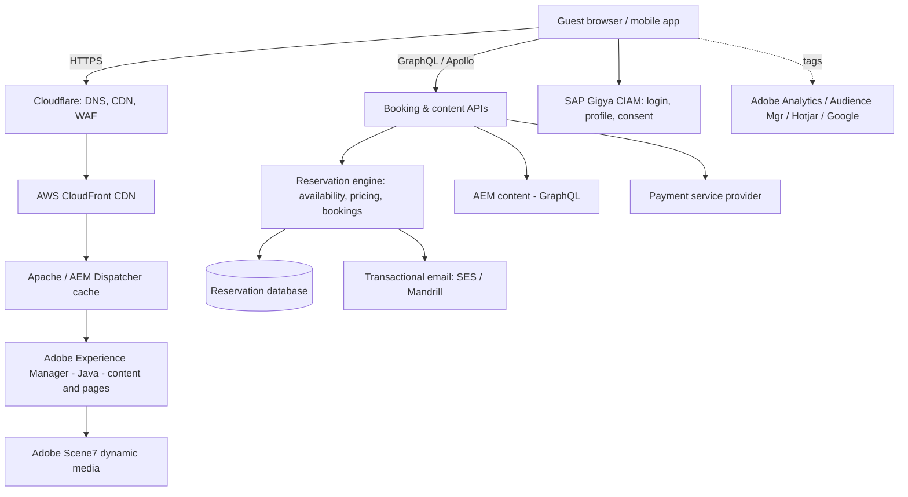

# Center Parcs — System Analysis
### What centerparcs.co.uk is, what it's built with, and what each piece does

*A reverse‑engineering study of the system being imitated. This is reference material — it's essentially frozen once written, and explains the "why" behind decisions made in the other documents.*
*Sources: BuiltWith profile, Wappalyzer lookup, and centerparcs.co.uk public pages. Date: 4 June 2026*

**Companion documents**
- The plan for *your own* product (vision, scope, requirements) → `planning-and-requirements.md`
- The recommended stack and how to build it → `design-and-development.md` *(the single source of truth for technology choices; this analysis only describes what Center Parcs uses, not what you should pick)*

The framing to keep in mind: **Center Parcs is a £100m+ Adobe‑enterprise build. The goal is never to copy their stack — it's to understand their *capabilities* so they can be re‑implemented leanly.** Most of what's detected below is enterprise tooling replaceable by one or two modern services.

---

## Part 1 — The business & booking model

centerparcs.co.uk is not a generic e‑commerce site; it is a **reservation platform for time‑and‑inventory‑constrained holiday accommodation, with a layered activity‑booking system on top.** Understanding that shape matters more than any individual technology.

**The business.** Center Parcs operates five UK forest "villages" (Sherwood, Elveden, Longleat, Woburn, Whinfell) plus one in Ireland. Each village is ~400 acres of car‑free woodland holding hundreds of self‑catering lodges plus apartments, hotel rooms (Woburn) and Treehouses, alongside a pool ("Subtropical Swimming Paradise"), a spa, restaurants and 200+ bookable activities. A guest books a **whole lodge for a date range, priced per lodge (not per person)**, then layers on extras and activities.

**The booking lifecycle** (the spine of the whole application):

1. **Discover** — an anonymous visitor browses villages, lodge types, activities and pricing (content‑heavy, SEO‑critical).
2. **Search availability** — pick a village, dates and party size; the system returns available lodge types with live prices.
3. **Select & configure** — choose a specific lodge type/location, see what's included.
4. **Add guests** — the lead booker enters every guest, including children's dates of birth; invited guests can receive an email and gain limited access to the booking.
5. **Optional extras** — early check‑in, cycle hire, "Flex" cancellation cover, dog‑friendly options. Added at booking or later.
6. **Pay** — a deposit now, with the **balance due ~10 weeks before arrival** (a payment *schedule*, not a single charge).
7. **Pre‑arrival window** — from **12 weeks before arrival**, the guest can pre‑book activities, reserve restaurant tables (often a small per‑person deposit), and order grocery essentials ("ParcMarket") to the lodge.
8. **Stay & manage** — a mobile app lets guests manage the booking, view a shared itinerary, and navigate the village.
9. **Post‑stay** — reviews, repeat‑guest offers, marketing.

**Why this shape is demanding.** Three properties of the domain dictate almost every hard engineering decision any builder faces here:

- **Perishable, finite inventory.** A lodge‑night that goes unsold is lost forever, and the same lodge cannot be sold twice for overlapping dates. This forces real **concurrency control, availability holds, and transactional integrity** — the single most important non‑trivial part of the system.
- **Time‑gated capabilities.** The 12‑week activity window and the deposit/balance schedule mean the system is **stateful over months** and driven by **scheduled jobs and date logic**, not just request/response.
- **Nested bookings.** A "booking" is a tree: accommodation → guests → extras → activities → restaurant reservations → grocery orders, each with its own availability, pricing and cancellation rules.

Get the domain model right and the rest is plumbing. Get it wrong and no framework choice will save you.

---

## Part 2 — The detected stack, decoded layer by layer

Here's what BuiltWith and Wappalyzer detected, organised into the layers that actually matter, with a plain‑English explanation of each. (Wappalyzer's view is the "honest summary": **CMS = Adobe Experience Manager, language = Java, PaaS = AWS, CDN = CloudFront + Cloudflare, analytics = Adobe + Google.** BuiltWith adds the long tail.)

### 2.1 Content & experience layer — Adobe, all the way down
- **Adobe Experience Manager (AEM)** — the core CMS / Digital Experience Platform. A heavyweight, **Java‑based** enterprise system (it runs on OSGi/Apache Sling under the hood) that manages content, page templates, reusable components and multi‑site/multi‑locale delivery. This is the "spine" Wappalyzer reports.
- **Adobe Scene7 / Dynamic Media** — on‑the‑fly image rendering, zoom and responsive image delivery (all those lodge photos at the right size for each device).
- **Adobe Experience Cloud / Enterprise Cloud** — the umbrella suite (analytics, audience, asset management) that AEM plugs into.
- **Schema.org Organization & ContactPoint, hreflang** — structured data and language signalling for SEO.

> **Decode:** A £‑expensive enterprise content platform whose *job* is "let non‑developers manage marketing pages and media at scale, with strong SEO." A lean build replaces the whole thing with a headless CMS.

### 2.2 Front‑end layer — a hybrid of modern + legacy
- **Vue.js + Vuex** — the interactive front‑end framework and its state store. This is almost certainly the **booking application / interactive components** layered on top of AEM‑rendered pages.
- **Apollo GraphQL** — a GraphQL client, which strongly implies a **GraphQL API** sits between the front end and back‑end services (AEM itself can expose content via GraphQL; the booking engine likely has its own).
- **jQuery, jQuery UI, jQuery Cookie, Slick (carousels), Lightbox** — older interactivity, typical of a site that has evolved over many years (the domain dates to 1997).
- **lodash, Moment.js, Day.js, core‑js, Intersection Observer** — JS utilities, date handling and polyfills.

> **Decode:** A classic "big site that grew over time" — a modern SPA framework (Vue) coexisting with legacy jQuery. A new build starts clean with one framework.

### 2.3 Identity & access (CIAM)
- **Gigya** — now **SAP Customer Data Cloud**. The **customer identity platform**: registration, login, social sign‑in, profile storage and consent management. It is the guest account system.
- **Cisco Duo** (detected as "Make it Fly") — MFA/SSO, almost certainly for **staff/internal** access, not guests.
- **WebAuthn** — passkey support for passwordless login.

> **Decode:** Two distinct identity needs — **customer identity (CIAM)** for guests and **workforce identity** for staff. They should stay separate in any design.

### 2.4 Payments
- **Mastercard Secure Remote Commerce** ("Click to Pay") and **Discover** acceptance, with **Pound Sterling** as the currency.
- No single dedicated payment gateway (Stripe/Adyen/Worldpay) is fingerprinted — typical, because the actual card capture usually happens in a hosted/iframed PSP component that scanners don't see.

> **Decode:** They accept cards with modern wallet‑style checkout and clearly run a **deposit‑plus‑balance** payment schedule. A lean build uses a single PSP that handles PCI scope.

### 2.5 Analytics, marketing & tag management
- **Adobe Analytics** (plus its legacy name **Omniture SiteCatalyst**) — enterprise web analytics.
- **Adobe Dynamic Tag Management (Adobe Launch)** — the tag manager that injects all the tracking scripts.
- **Adobe Audience Manager** — a Data Management Platform for ad audience segmentation.
- **Hotjar** — heatmaps, session recording and on‑site surveys (UX research).
- **Google Global Site Tag / Google Ads Conversion / AdSense** — Google measurement and advertising.
- **HubSpot** — marketing automation, CRM and lead capture.
- **Oracle CX (RightNow)** — customer‑service / engagement platform.
- **Pinterest, Facebook domain verification** — social channels.

> **Decode:** A large, overlapping martech estate accumulated over years. One product‑analytics tool + one ads pixel replaces almost all of it for a smaller business.

### 2.6 Email & messaging
- **Microsoft Exchange Online / Office 365** — corporate staff email.
- **Salesforce (SPF record)** — marketing email sending (Salesforce Marketing Cloud).
- **Amazon SES** and **Mandrill** — transactional email (booking confirmations, balance reminders).
- **SPF, DMARC (policy: reject)** — email‑authentication hardening so phishers can't spoof the domain.

> **Decode:** Separate **transactional** (SES/Mandrill) and **marketing** (Salesforce) email paths — a distinction worth preserving. The strict DMARC "reject" policy is a security‑maturity signal worth copying cheaply.

### 2.7 Hosting, network & delivery
- **Amazon Web Services** — compute on **EC2 in the Ireland region (eu‑west‑1)**, behind **Elastic Load Balancing (classic ELB + ALB)**.
- **Amazon CloudFront** — the CDN (the long list of "edge" cities is just CloudFront's global PoPs, not separate infrastructure).
- **Cloudflare** — additional CDN/DNS and almost certainly **WAF / DDoS protection** in front.
- **Apache** — web server; in an AEM context this is typically the **AEM Dispatcher** (a caching/security layer in front of AEM).
- **DigiCert SSL, HSTS, SSL‑by‑default** — TLS everywhere, enforced.
- **CSC / NetNames DNS** — corporate‑grade domain registration and DNS (brand protection), not application infrastructure.

> **Decode:** A standard, mature **AWS‑in‑eu‑west‑1 + Cloudflare‑in‑front** topology. A smaller build can run the same pattern at a fraction of the footprint.

### 2.8 Back‑office, security & dev tooling
- **Atlassian Cloud (Jira, Confluence)** — engineering project management and documentation.
- **KnowBe4** — staff security‑awareness / phishing‑simulation training.
- **DocuSign** — e‑signatures (plausibly for group/corporate bookings or supplier contracts).

> **Decode:** These are *organisational* tools that leak into DNS/email records. They show the company is run with mature process — useful context, but not part of the customer‑facing application.

---

## Part 3 — Architecture: how the pieces fit together

Putting Part 2 together, the live system is a textbook **Adobe Experience Cloud DXP fronting a separate reservation engine**:

The flow in words: a request hits **Cloudflare** (DNS, CDN, WAF), then **AWS CloudFront**, then the **AEM Dispatcher (Apache)** cache, and finally **AEM (Java)** for content pages. The interactive **Vue** booking app calls a **GraphQL API (Apollo)** that talks to the **reservation engine** (availability, pricing, bookings) and to AEM for content fragments. **Gigya** handles guest identity. A **PSP** handles card payments. **SES/Mandrill** send confirmations. A swarm of **Adobe/Google/Hotjar** tags handle measurement. Everything runs on **AWS eu‑west‑1**.

The crucial insight: **the reservation engine is the part BuiltWith can't see, and it's the part that matters most.** Availability, pricing, holds, the deposit/balance schedule, the 12‑week activity window — none of that is a detectable "technology," it's the bespoke core. That's where a new build's effort should go.

---

## Appendix A — Full detected technology inventory

A descriptive catalogue of what was detected and what each thing does *for Center Parcs*. (What each would be replaced with in a smaller build is covered in `design-and-development.md`, §3.1 and §3.8 — kept there to avoid two drifting copies.)

| Detected technology | Category | What it does |
|---|---|---|
| Adobe Experience Manager | CMS / DXP | Java‑based enterprise CMS: content, templates, components, multi‑site/locale |
| Java | Language | The language AEM and the back‑end services run on |
| Vue + Vuex | Front end | Interactive booking UI and its state, layered on AEM pages |
| Apollo GraphQL | API client | Implies a GraphQL API between the front end and back‑end services |
| jQuery / UI / Cookie, Slick, Lightbox | Legacy front end | Older interactivity — carousels, modals, cookie handling |
| lodash, Moment/Day.js, core‑js | JS utilities | Helper functions, date handling, browser polyfills |
| SAP Gigya | CIAM | Guest identity: registration, login, social sign‑in, consent |
| Cisco Duo | Workforce MFA/SSO | Protects staff/internal access |
| WebAuthn | Passkeys | Passwordless/passkey login support |
| Mastercard SRC / Discover | Payments | Click‑to‑Pay wallet checkout and card acceptance |
| Adobe Analytics / Omniture | Analytics | Enterprise web analytics |
| Adobe Dynamic Tag Mgmt (Launch) | Tag manager | Injects and manages tracking scripts |
| Adobe Audience Manager | DMP | Ad audience segmentation |
| Hotjar | Heatmaps / replay | UX research: heatmaps, session recording, surveys |
| Google Site Tag / Ads / AdSense | Ads / measurement | Google measurement and advertising |
| HubSpot | Marketing / CRM | Marketing automation and lead capture |
| Oracle CX (RightNow) | Customer service | Service / engagement platform |
| Salesforce (SPF) | Marketing email | Sends marketing email |
| Amazon SES / Mandrill | Transactional email | Booking confirmations, balance reminders |
| SPF / DKIM / DMARC reject | Email security | Anti‑spoofing email authentication |
| Adobe Scene7 | Dynamic media | On‑the‑fly image rendering and responsive delivery |
| AWS EC2 / ELB / ALB (eu‑west‑1) | Compute | Hosting + load balancing in the Ireland region |
| Amazon CloudFront | CDN | Global content delivery via edge PoPs |
| Cloudflare | CDN / DNS / WAF | Edge delivery and security in front of everything |
| Apache (AEM Dispatcher) | Web server / cache | Caching + security layer in front of AEM |
| DigiCert SSL / HSTS | TLS | Encryption in transit; enforced HTTPS |
| DocuSign | E‑signature | Document signing (group/corporate/supplier) |
| Atlassian Cloud (Jira/Confluence) | Dev tooling | Internal project management and documentation |
| KnowBe4 | Security training | Staff phishing‑awareness training |
| CSC / NetNames DNS | Registrar / DNS | Corporate domain registration and DNS |

## Appendix B — Signals that are *not* part of the stack

When reading BuiltWith, ignore these — they're dataset/popularity/SEO signals, not application technologies, and will mislead anyone who treats them as architecture:

- **CrUX Dataset / CrUX Top 50k, Cloudflare Radar Top 100k/200k, CommonCrawl Top 250k, BuiltWith Top Site Rank** — third‑party popularity rankings; they just mean the site is well‑trafficked.
- **Common Crawl** — the site was crawled into a public web dataset (often used to train LLMs); nothing the site "uses."
- **Apple Whitelist, Apple Mobile Web Clips Icon, iPhone/Mobile Compatible, Viewport Meta** — standard mobile‑friendliness markers.
- **Pre Year 2000 / Pre Year 2010 / Site Age (1997)** — domain‑age trivia.
- **"Adult Content"** — a near‑certain **false positive** from BuiltWith's classifier; disregard it.
- **English – Inferred / HREF LANG, Pound Sterling, Companies House, Wikipedia, Modern Slavery Statement, Careers/Events page, social‑media mentions, Google Policies** — content/SEO/compliance signals, not stack.
- **The long list of "AWS CloudFront <city> Edge" entries** — these are just CloudFront's global edge locations, i.e. one CDN, not dozens of deployments.
- **AI Index (41/100, Agent Readiness 0)** — BuiltWith's own readiness score. Mildly interesting as an *opportunity*: the incumbent scores low on machine/agent readiness, so building clean structured data and an API‑first design from day one is a cheap differentiator.

---

*End of analysis. For the plan built on top of this understanding, see `planning-and-requirements.md`; for the stack and implementation, see `design-and-development.md`.*
