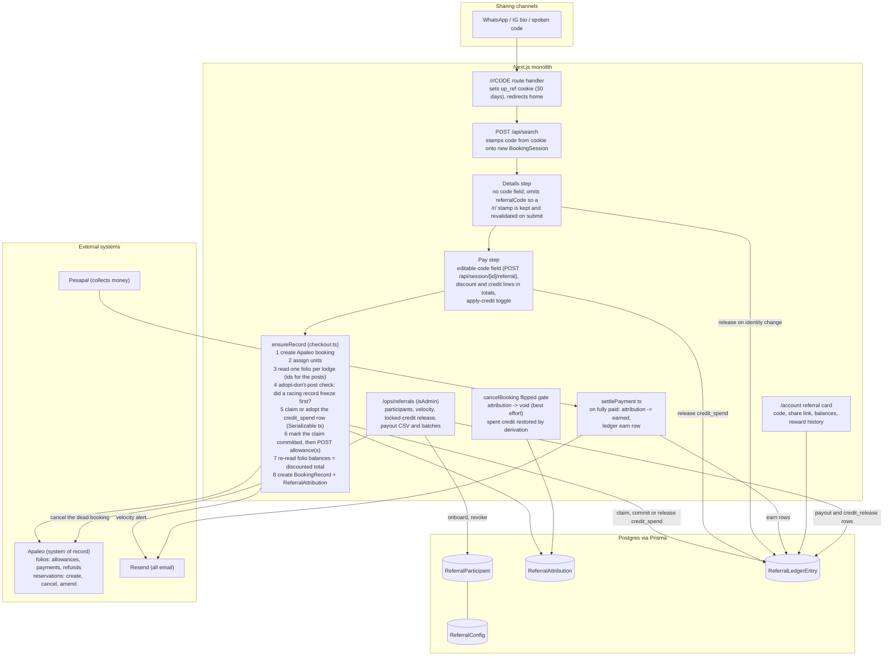
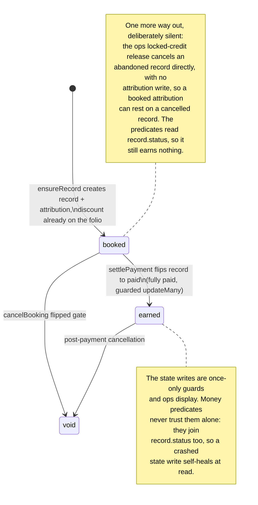

# Referral system: design and implementation reference

Status: BUILT, 6 Aug 2026, on branch `referral-system` (commits 84e161e,
999763d, 80a4cba, 4762803). Scope: the original two groups from the
Referral Growth System report v2.0 (Drive), the influencer track (cash
commission) and the client track (guest-to-guest credit). The Unity
Family and group-organizer tracks are deferred; the schema deliberately
leaves room for them.

Three rounds of post-build adversarial review found two blocking defects
apiece. The second round's were regressions in the first round's fixes
and the third round's was a regression in the second's, all in the
credit-claim lifecycle, which is why section 11 names that mechanism as
the most fragile thing here. All fixes are in code and verified by live
sandbox bookings covering the discount path, the credit path and the ops
locked-credit release.

This document describes what the system does, and why it does it that
way. Every claim about code carries a file reference, every design
decision states the alternative it beat and why, and section 11 lists the
places most worth poking at. Where a design was considered and rejected,
the reason is recorded, because that is the part a future reader cannot
recover from the code. Line numbers drift as files change: treat the
symbol names as the durable half of each anchor.

---

## 1. What we built

Two referral tracks on one engine:

- **Influencer track.** A vetted creator gets a permanent vanity code
  (AMINA), onboarded by an admin. Bookings made with it give the guest an
  instant fixed discount, and after the stay completes the influencer
  earns a percentage commission on the lodging value, paid out monthly as
  real money (manual M-Pesa or bank transfer, CSV-driven).
- **Client track.** Any guest with an account can claim a permanent code,
  and the code is minted the moment they ask for it, never before. Same
  instant discount for the referred guest; the referrer earns a fixed
  resort credit that becomes spendable after the referred stay completes,
  redeemable against their own next booking. Credit only, never cash.

Engine principles inherited from the report, all intact:

- A code identifies a person and nothing else. Amounts live in dated
  config rows; the config in force when the booking is created picks the
  numbers. Codes are never reissued.
- The code is captured at our checkout. Apaleo has no concept of
  referrals.
- Money in is instant (the discount is visible before payment), money out
  vests post-stay.
- Append-only ledger. No stored balance column anywhere; a balance is
  always a sum over a participant's rows.
- One code per booking, frozen at booking creation, no stacking.

Not built, deliberately: webhooks, schedulers, WhatsApp, payout
automation, tier automation, a review-queue UI, cross-vertical namespace
activation. Section 10 shows where each one bolts on.

---

## 2. The mental model in one paragraph

The referral engine is a passenger on the existing booking machine, not a
second machine. It stamps a code onto the `BookingSession`, posts one
discount onto the Apaleo folio at the only moment the money math allows
it (inside `ensureRecord`, before the folio re-read that freezes the
booking's totals), and records an attribution row in the same breath as
the `BookingRecord`. The booking machine then writes referral rows at
only two moments, the guarded status flip to `paid` (earn the reward) and
the guarded flip to `cancelled` (void it). Three writes sit outside that
pair and are named here so they are not a surprise: the credit claim
row's own lifecycle stamps (a checkout committing it to a folio, a guest
or an admin giving it back), the display-flag reconciliation
`ensureRecord` runs when it finds a record already frozen, and the ops
actions, which are a human's writes by definition. Everything else,
vesting, expiry, balances, payout dues, even the restoration of spent
credit when a booking cancels, is derived at read time from the ledger
plus the booking's own state. That is the house pattern: the deposit plan
ruled out "any scheduler or jobs table" and declared "Overdue is
display-only, derived at read time"
(`docs/deposit-and-cancellation-plan.md:86-88`).

### House patterns this document leans on

Six idioms carry the concurrency story below. In one line each:

- **Guarded updateMany**: an `updateMany` whose `where` includes the state
  being left, so under any race exactly one caller sees `count === 1` and
  knows it won the transition (the settle's status flip at
  `server/booking/checkout.ts:1141`, the attribution's `booked -> earned`
  flip at `checkout.ts:1200`, the cancel flip at
  `server/booking/cancellation.ts:217`).
- **Flipped gate**: the block in `cancelBooking` entered only when its
  guarded updateMany returned count 1; the cancellation email already
  lives there (`server/booking/cancellation.ts:221`).
- **Claim-release stamp**: a nullable DateTime claimed atomically
  (updateMany where the column is null) before sending an email, released
  only on send failure, so an email can never send twice
  (`server/email/bookingConfirmation.ts:41`).
- **P2002 adopt-the-winner**: two racing checkout tabs; the loser's create
  hits the unique constraint and adopts the winner's record instead of
  erroring (the catch in `ensureRecord`,
  `server/booking/checkout.ts:733-745`).
- **Session row as the only attribution source**: checkout retries can
  arrive logged out and cookieless, so anything checkout needs must live
  on the `BookingSession` row, never in a cookie (the ownership comment
  and `userId: session.userId` in the record create,
  `server/booking/checkout.ts:708-710`).
- **Guarded write on the claim row**: the credit claim's whole state lives
  on the spend row itself, so a checkout committing it to a folio and a
  guest giving it back are two guarded updateManys on the SAME row. The
  database serialises them, the loser reads count 0 and backs off
  (`server/referral/claim.ts:46-59`, `server/referral/claim.ts:87-93`).
  The one idiom this build added rather than inherited.

---

## 3. Architecture



The attribution lifecycle. It is smaller than the report's five states
because a refused code is a synchronous rejection (nothing is stored) and
the report's REWARD_ISSUED and SETTLED live in the ledger, not on the
attribution:



---

## 4. Data model

Four new Prisma models. Conventions follow the existing schema: money is
Float whole KES (same demo caveat as `BookingRecord.totalGrossAmount`,
`prisma/schema.prisma:238`), states are plain strings, emails are stored
lowercase via `normalizeEmail` (`server/auth/normalize.ts:8`). Schema
changes ship by `prisma db push`, local first, never `prisma migrate`
(this repo has no Prisma migrations directory; the root `migrations/` is
Payload's own system and unrelated).

`BookingRecord` gains only a back-relation, omitted here for brevity.
`BookingSession` gains four real columns as well: `referralCode` and
`referralDiscount` (the code stamped from the cookie at search, and the
advisory discount snapshot the details submit and the pay step's code
field write), `applyCredit` and
`creditAmount` (the pay step's redemption choice), plus the back-relation
to its one credit spend. `User` gains `isAdmin Boolean @default(false)`,
which is what gates the ops pages (section 8); it is flagged by hand with
`scripts/make-admin.mjs` and has no in-app path.

```prisma
// A person who can refer: an influencer we onboarded or a client who
// claimed their code. The code is permanent and identifies the person,
// nothing else; amounts live in ReferralConfig.
model ReferralParticipant {
  id        String    @id @default(cuid())
  createdAt DateTime  @default(now())
  kind      String    // "influencer" | "client" (room for "family", "organizer" later)
  name      String
  email     String?   // lowercase; self-use checks compare against this
  phone     String?
  // generated codes are 6 chars from an alphabet without 0/O/1/I; typed
  // and vanity codes are accepted at 3-12 letters and digits, uppercase
  code      String    @unique
  commissionRate Float? // influencers: null means the config default in force at booking
  userId    String?   @unique
  user      User?     @relation(fields: [userId], references: [id]) // client participants
  revokedAt DateTime? // revoked codes refuse at validation; rows are never deleted

  attributions ReferralAttribution[]
  ledger       ReferralLedgerEntry[]
}

// Dated program parameters. Append-only: to change an amount, insert a
// new row with a later effectiveFrom. "In force" always means the latest
// row whose effectiveFrom is on or before the UTC date ensureRecord runs,
// never the stay dates.
model ReferralConfig {
  id             String   @id @default(cuid())
  createdAt      DateTime @default(now())
  effectiveFrom  String   // ISO date
  guestDiscount  Float    // whole KES off the referred booking, once per booking
  clientCredit   Float    // whole KES credit for a client referrer
  defaultCommissionRate Float // used when an influencer's own rate is null
  creditExpiryDays      Int  // client credit only; commissions never expire

  attributions ReferralAttribution[]
}

// One referred booking. Created inside the same nested create as the
// BookingRecord, so it exists exactly when the record exists (the P2002
// adopt-the-winner race makes any later write unsafe). All amounts are
// frozen here; discountAmount is what was actually posted to the folios.
model ReferralAttribution {
  id        String   @id @default(cuid())
  createdAt DateTime @default(now())

  recordId String        @unique
  record   BookingRecord @relation(fields: [recordId], references: [id])
  participantId String
  participant   ReferralParticipant @relation(fields: [participantId], references: [id])
  // A real relation, not just an id: expiry is computed at read time from
  // this frozen config row (6.3).
  configId String
  config   ReferralConfig @relation(fields: [configId], references: [id])

  discountAmount Float  // posted to the folio(s), not the configured number
  rewardAmount   Float  // frozen: clientCredit, or rate * commissionBase
  commissionBase Float? // influencer only: lodging gross minus discount, floored at 0
  gift Boolean @default(false) // the code's owner is paying: discount yes, reward no

  state    String    @default("booked") // booked | earned | void
  earnedAt DateTime?
  voidedAt DateTime?
  allowanceRefs String @default("[]") // JSON array of Apaleo allowance ids
  rewardEmailAt DateTime? // claim-release stamp for the referrer's email

  ledger ReferralLedgerEntry[]
}

// Append-only value ledger. Every amount is SIGNED whole KES: earns and
// releases positive, spends and payouts negative. Every derived figure is
// a plain SUM(amount) over a filtered set of rows. No value row is ever
// rewritten or deleted; the one exception is the credit_spend claim's own
// lifecycle stamps below, which are guarded writes on that row and never
// touch an amount.
model ReferralLedgerEntry {
  id        String   @id @default(cuid())
  createdAt DateTime @default(now())

  participantId String
  participant   ReferralParticipant @relation(fields: [participantId], references: [id])
  // Earns point at their attribution. Spend, payout and release rows keep
  // this null; Postgres treats nulls as distinct in unique indexes, so
  // they never collide on the earn constraint, and they must stay null.
  attributionId String?
  attribution   ReferralAttribution? @relation(fields: [attributionId], references: [id])

  kind   String // credit_earn | credit_spend | commission_earn | payout | credit_release
  amount Float  // signed: earns/releases positive, spends/payouts negative

  // credit_spend: the BookingSession the redemption rode. One spend per
  // session, ever; the record does not exist yet when the claim is made,
  // and BookingRecord.sessionId is unique so the session names the record.
  spentOnSessionId String?         @unique
  spentOnSession   BookingSession? @relation(fields: [spentOnSessionId], references: [id])
  // credit_release: the spend it unlocks (one per spend, ever).
  releaseOfEntryId String? @unique

  // The credit_spend lifecycle, carried ON the spend row so that releasing
  // a claim and committing it to a folio are guarded writes to the SAME
  // row (6.3). releasedAt: back in the pool, never re-usable.
  // postingStartedAt: committed to a folio allowance, so no release may
  // follow except the ops one.
  releasedAt       DateTime?
  postingStartedAt DateTime?

  payoutBatchId String? // payout rows: deterministic batch id

  // One earn of each kind per attribution, ever.
  @@unique([attributionId, kind])
  // One payout per influencer per batch, ever: the DB half of the
  // deterministic-batch discipline (6.4). A re-run is a constraint
  // violation, not a second payment.
  @@unique([participantId, payoutBatchId])
  // Keeps the Serializable spend-claim transaction's predicate locks to
  // one participant's rows instead of the whole relation, so two guests
  // redeeming at once never abort each other (6.3).
  @@index([participantId])
}
```

Two invariants, enforced ruthlessly, both from the report: amounts are
computed once from the config in force and frozen (config and
participant-rate edits never change history), and no balance is ever
stored, only summed.

These are declared relations rather than bare id columns because every
flow depends on traversing them: the attribution rides `BookingRecord`'s
nested create through a relation field (the `reservations:` create in
`ensureRecord` is the in-repo precedent), and every derived predicate
below walks ledger to attribution to record to session.

Why no separate `codes` table: the report has one to support revocation
with reissue. Our rule is one permanent code per person, and revocation
means revoking the person (`revokedAt`). A join table with one row per
person forever is structure without information.

---

## 5. The money path

This is the load-bearing section. The existing payment engine has a
strict internal consistency contract, and there is exactly one safe way
to introduce a discount.

First the Apaleo vocabulary. Every lodge in a booking gets its own
**folio**, the guest's bill: charges on one side, payments on the other,
and a running **balance** that is negative while money is owed and zero
when settled (`server/apaleo/bookings.ts:97`); the engine always reads
the absolute value. An **allowance** is Apaleo's discount line on a
folio: posting one reduces what the folio demands, so the balance shrinks
by the allowance amount while the original charges stay visible, which is
what finance wants and what makes program cost a query. That was a
hypothesis when this document was written and Phase 0 proved it against
UPNV (5.3); `postAllowance` (`server/apaleo/payments.ts:48`) is the one
helper that speaks it.

### 5.1 How the engine freezes money

`ensureRecord` (`server/booking/checkout.ts:578`) creates the Apaleo
booking, assigns units, then reads one folio per lodge and computes
`total = sum of |folio.balance|`. That number becomes
`BookingRecord.totalGrossAmount`, each lodge's `grossAmount`, and the 30%
`depositAmount`, written once in a single nested create and never updated
again. Every later actor validates against it:

- Pesapal collection amounts must match within 0.01
  (`server/pesapal/status.ts:33`).
- `settlePayment` accepts exactly two live folio balances per lodge:
  untouched, or already-posted-by-a-crashed-replay (the `untouched` and
  `alreadyPosted` check, `server/booking/checkout.ts:1035-1072`). Anything
  else wedges the booking with "Folio drifted from local bookkeeping".
- `paidAmount` is derived as `grossAmount - |folio.balance|`, so any
  post-hoc folio change silently corrupts paid math even where the wedge
  does not fire.

Consequence: **the discount must exist on the folio before the balance
re-read that freezes the totals (`checkout.ts:683-689`), and can never be
posted later.** On a `created` or `deposit_paid` booking, a late
allowance wedges the next settle. On a fully `paid` booking nothing
wedges (no settle ever runs again), but the failure is quieter and still
forbidden: the folio strands a credit nobody refunds, and a later
amendment would silently absorb it (`amend/route.ts:200` settles only
negative balances). Broken differently in every state, so: never,
including an admin "fixing" a missed code after the fact.

### 5.2 Where the discount is born

Inside `ensureRecord`, strictly after `assignUnits` (whose 422 fallback
can drop a location fee) and strictly before the folio re-read. The
folios are read once beforehand because the allowance call needs folio
ids. The referral step then:

1. Re-validates the code from the session row (exists, not revoked, not
   self-use). The session snapshot is display-only; this check is the
   authoritative one. **If it refuses** (code revoked mid-funnel, or
   self-use only now detectable from final guest details), the checkout
   fails with a friendly message and, in the same breath, the code and
   discount snapshot are cleared off the session so every totals surface
   re-renders honestly. That mirrors the `locationFeeDropped` cleanup
   discipline. Silently proceeding undiscounted is not an option: the
   guest would be charged more than every screen showed them.
2. Computes `discountAmount` from the config in force. Whole KES,
   `Math.round`, matching house arithmetic, then caps it so at least KSh
   500 of the booking stays collectable (the same floor the part-payment
   rules enforce, `lib/paymentPlan.ts:15`). A cap that bites is never
   applied quietly: the reduced figure is restamped on the session and
   the attempt is refused, so the guest reviews the honest total first.
   A second refusal covers a basket that shrank after a credit claim was
   committed, where discount and credit together no longer fit.
3. Splits it across the N folios pro-rata, **basis: the session's
   per-lodge snapshots** (stayGrossAmount + extras + location fee), last
   folio takes the exact remainder, shares clamped. The snapshots exist
   before the record does and are identical on every retry, which makes
   the split deterministic under crash-replay. (The first draft split by
   live folio balance; settle's own doc comment forbids exactly that, and
   the adversarial review spelled out why: a crash between two posts
   changes a live-balance basis on replay, inflating the recomputed
   shares and mutating the idempotency key's body, which is what defeats
   Apaleo's dedup.)
4. Posts each share as a Finance API allowance, idempotency key
   `up-allow-<sessionId>-<slot>`, reason `UP-REFERRAL-<code>`, following
   the payFolio conventions. `server/apaleo/client.ts` stays the only
   file speaking HTTP to Apaleo.

One non-money side effect rides here too: once the code has validated,
checkout counts that code's attributions over the rolling window and, at
or above the threshold, logs loudly and emails `OPS_ALERT_EMAIL` (section
9). The send is fire-and-forget and its failure is swallowed. An alert
must never block a checkout, and with no ops address configured the log
alone stands.

The folios are then read a second time, but only when something was
actually posted (checkout skips the round trip when there was no discount
and no credit). That second read is the one that freezes the booking, and
it **absorbs the discount into everything automatically**:
`totalGrossAmount`, per-lodge `grossAmount`, `depositAmount` (so the 30%
deposit is 30% of the discounted total), the Pesapal order, the settle
split basis, balance-payment outstanding
(`app/api/booking/[bookingId]/pay/route.ts:48`), and cancellation refunds
(`computeRefund` works from `paidAmount`/`depositAmount`,
`lib/paymentPlan.ts:81`). No downstream code learns the discount exists.
This is the single biggest simplification in the design and the reason
the allowance approach was chosen.

One freeze rule completes the picture: **once a `BookingRecord` exists,
the session's referral fields are read-only.** The details route refuses
the whole submit with a 409 the moment it finds a record, before it
parses a field, and the referral write is guarded a second time inside
`setReferralOnSession`, whose `updateMany` filters on `booking: null`
(`server/booking/session.ts:261-275`). The pay screen itself does not yet
render the code as fixed; the guest can edit the field and see an
advisory discount line, and the 409 is what stops them. That is honest
but not pretty, and it is the one piece of this rule still owed a UI.

The rule exists for a concrete failure: without it a guest returning to
the code field after a failed payment could stamp a new code the frozen
record will never honour, and the pay page would then display a discount
Pesapal will not collect. `setGuestDetails` still updates its own columns
unconditionally, which is why the referral write needed its own guard
rather than inheriting one. Since the field lives on the pay step, that
same guard is what `POST /api/session/[id]/referral` turns into the 409:
`setReferralOnSession` returns whether its write landed.

Crash windows: `ensureRecord` is a sequence of network calls with no
umbrella transaction; recovery is by idempotency keys plus the P2002
adopt-the-winner path. The allowance posts get the same protection as the
booking create itself (24h Apaleo dedup window). A checkout stuck for
more than 24h mid-sequence is already a manual case today; the allowance
inherits that boundary rather than inventing a stronger one.

### 5.3 What Phase 0 proved in the sandbox

Nothing in the repo had ever called the allowances endpoint, so the spike
ran before anything else. All six items passed against UPNV on the first
attempt, and the answers are frozen into `postAllowance`
(`server/apaleo/payments.ts:48`):

1. POST `/finance/v1/folio-actions/{folioId}/allowances` succeeds on a
   fresh folio with our existing credentials. The scope is
   `folios.manage`, which they already carried, so no Apaleo app change
   was needed. Besides the amount the body needs `serviceType`
   ("Accommodation"), `vatType` ("Without": UPNV's sandbox prices
   everything without VAT and the folio rejects a type its charges do not
   carry) and a `reason` string, which is what carries
   `UP-REFERRAL-<code>` onto the bill.
2. The folio balance afterwards equals gross minus allowance, which is
   what `ensureRecord` reads.
3. A later `payFolio` of exactly that balance settles the folio to zero.
4. `refundFolio` behaves on a folio carrying an allowance.
5. The folio's allowances array is well formed and the VAT breakdown
   coherent.
6. Amending a reservation whose folio carries an allowance, to costlier
   and to cheaper dates, leaves the balance reading as new gross minus
   allowance minus payments. Apaleo keeps the allowance across an
   amendment, which the amend route's phantom-payment settling depends
   on. This item earned its place because the failure is invisible: if
   Apaleo ever voids or reattaches allowances on amendment, it surfaces
   as silent over or under payment a year later, so re-run this check if
   Apaleo's amendment behaviour changes.

Note the payments and refunds endpoints live under `/finance/v1/folios/`,
while allowances live under `/finance/v1/folio-actions/`. That asymmetry
cost the spike a run.

Fallback, never needed: had allowances been unusable, the discount would
have posted as a method "Other" *payment* at the same point in
`ensureRecord`. Mechanically identical (the balance shrinks before the
reads), and precedent exists (the amend route already absorbs reprice
debits with phantom "Other" payments), but it records money-received that
never existed, so program cost reporting and folio honesty degrade. No
code implements it. Rejected outright: adjusting the charged amount
locally. The engine's invariant is that no price is ever computed locally
(`server/apaleo/bookings.ts:74-78`), and the settle validations would
fight a local discount at every step.

### 5.4 Display totals

Five surfaces show money and all five must agree with the folio truth.
Each carries two possible lines, the referral discount and any applied
referral credit:

1. The session GET (`app/api/session/[id]/route.ts:102-114`), which feeds
   every funnel page. It returns the code with its advisory discount
   snapshot, which is null when a `/r/` link stamped the code at search
   time and neither the details submit nor the pay step's Apply has
   revalidated it yet, plus a separate credit block holding the amount
   the pay step stamped.
2. The right-rail `BookingSummary`
   (`components/BookingSummary.tsx:141-157`): a discount row and a credit
   row, both feeding its total bar.
3. `PayClient`'s advisory sum: subtracts both before rendering the buy
   button and the deposit split, and refetches from the server after any
   refused checkout, because a refusal may have removed either one.
4. The confirmation page, which the first draft forgot: it itemises
   per-lodge `stayGrossAmount` snapshots next to the folio-derived record
   total, and on a referred booking those lines would visibly sum to more
   than the total. It renders two rows, a "Referral discount" line read
   from the attribution (which exists whenever the record exists) and a
   "Referral credit applied" line, which is NOT on the attribution: the
   booking route derives it from the session's unreleased `credit_spend`
   row, because a claim released before the record existed put nothing on
   the folio (`app/api/booking/[bookingId]/route.ts:11-16`).
5. The account referral card, whose reward history counts exactly what
   the balance above it counts (section 8).

Server-side money never trusts the funnel numbers; they are advisory,
like everything else in the funnel.

---

## 6. Lifecycle walkthroughs

### 6.1 A referred booking, end to end

1. Brian taps `unityparks.com/r/AMINA` in WhatsApp. `/r/[code]` is a
   route handler (the only place cookie writes are allowed) that sets an
   `up_ref` cookie (httpOnly, sameSite lax, 30 days) and redirects to the
   homepage. The funnel itself is cookieless by design; the referral
   cookie only bridges the gap until a `BookingSession` exists.
2. Brian searches. `POST /api/search` reads the cookie (it already reads
   the auth cookie there) and stamps the code onto the new session row,
   same pattern as `userId`. The stamp is a format check only, with no
   database lookup, so an unknown but well-formed code rides the session
   until the details submit refuses it silently and the pay step shows an
   empty field. The cookie is not
   consumed by that first search: it lives its full 30 days, so a guest
   who came in through `/r/AMINA` carries the code onto every new search
   in that window. Clearing the field at the pay step clears only
   that session's columns, never the cookie, so the next fresh search
   stamps the same code again until it expires. Within a checkout the
   cookie is irrelevant from here on: the session row is the attribution
   source, and retries can arrive cookieless.
3. The details step renders no code field at all and omits `referralCode`
   from its submit body. That absence is load-bearing: an absent
   `referralCode` means keep and revalidate whatever is already stamped
   (a `/r/` link stamps a code with no snapshot, and a client that never
   renders the field must not wipe it), while an empty string would mean
   the guest cleared it. So Brian's AMINA stamp survives the step and
   picks up a fresh discount snapshot, revalidated authoritatively
   against the guest email and phone he just typed. A code that fails
   there is cleared from the session with no message on that step, which
   is a small honesty gap the pay step then shows plainly: the field
   arrives empty.
3a. At the pay step Brian sees "Referral code: AMINA" prefilled and
   editable, next to the credit toggle and directly above the total it
   changes. Apply calls `POST /api/session/[id]/referral`, which
   validates against the lead guest already saved at the details step
   (better contact data than that step could offer, since the guest is
   still typing it there) and persists via `setReferralOnSession`, the
   same separate guarded write, so the freeze rule still lives in the
   write itself. Last code standing at Buy now wins. A refused code
   clears the stamp rather than leaving a discount on screen that
   checkout would not honour. Because a bigger discount shrinks the room
   the credit cap allows, the route re-clamps any credit already stamped
   (no-claim case only; once a ledger claim exists `ensureRecord` owns
   the clamping), so the payable on screen is the payable charged.
   (Route naming caveat: explicit
   `app/api` routes beat Payload's catch-all, but a future Payload
   collection slugged `referral` would collide with `/api/referral/*`.
   Acceptable, noted.)
4. Buy now. `ensureRecord` runs section 5.2: allowances posted, the folio
   re-read absorbs them, `BookingRecord` and `ReferralAttribution`
   created in one nested create (atomic; the P2002 loser adopts the
   winner's record and creates nothing). Two money refusals can end the
   attempt before any allowance is posted, and both restate the total
   rather than charge a number no screen showed: a discount capped below
   the snapshot the funnel rendered, and a basket that shrank so far that
   discount plus committed credit no longer fit.
5. Brian pays (deposit or full) through the untouched Pesapal machinery.
6. When the record flips to `paid` (fully paid) inside settle's guarded
   transaction, two DB-only writes join it. The attribution's own guarded
   updateMany flips `booked -> earned`, and **only when that returns
   count 1** does the earn row insert: `commission_earn` or
   `credit_earn`, amount always the attribution's frozen `rewardAmount`,
   never recomputed from live rates or configs. This ordering matters:
   settle twins (callback vs IPN) both legitimately reach this code with
   the record already paid, so gating the insert on the record flip would
   double-fire. The `@@unique([attributionId, kind])` constraint stays as
   a backstop, but the insert is a `createMany` with `skipDuplicates`,
   which compiles to ON CONFLICT DO NOTHING, never a caught P2002: on
   Postgres a unique violation aborts the surrounding transaction even
   when the error is swallowed, which would take the whole settle down
   with it. Skipped entirely when `gift`.
7. Amina's "reward on the way" email sends from the settle tail, stamped
   once-only on `rewardEmailAt` with the claim-release discipline. It
   sits outside the checkout-versus-balance branch that sends the
   confirmation and the balance receipt, because the payment that
   completes a booking is often the balance payment, and the earn happens
   on whichever settle finishes it. The module is its own gate: an
   attribution that is not `earned`, and a participant with no email
   address, both return early without consuming the stamp. The email says
   the reward is **expected from** the stay's departure date, worded as
   an expectation because an amendment can move that date and a
   cancellation can void the reward after the email is sent (the same
   accepted window the confirmation email already lives with).

Referred bookings that never pay: a record can sit at `created` forever
(abandoned Buy now) or go `failed`; nothing in the engine terminates
those states. The attribution stays `booked` and earns nothing by
construction. Every ops surface excludes it from pending counts as soon
as its record is off the paid track, and the attribution list labels
those rows lapsed immediately: there is no freshness grace, so a booking
created seconds ago reads as lapsed while the guest may still be on the
Pesapal page. On the referrer's own account card such a booking is
not lapsed but invisible: no ledger row exists until the booking is fully
paid, so there is nothing to show and nothing to exclude. The card only
ever describes money that was actually earned, spent or pending. No new
state, no cleanup job.

### 6.2 Cancellation

`cancelBooking`'s flipped gate (`server/booking/cancellation.ts:217-221`)
gains exactly one write: flip the attribution to `void`. It is
deliberately best effort, wrapped and logged rather than thrown
(`cancellation.ts:257-264`), for the same reason the drift check above it
is: a throw would 500 a cancellation that has already refunded and
cancelled in Apaleo, and the retry would take the already-cancelled early
return and never send the email. A lost `void` write is harmless anyway,
because every money predicate joins `record.status` and treats a
cancelled record as void regardless; the attribution state is a once-only
guard and an ops label, not the truth.

The first draft had a second write here, a compensating `credit_reversal`
row restoring spent credit. Review one deleted it: the gate body is not
atomic with the status flip, and a crash between them never re-enters the
gate, because a retry takes the already-cancelled early return
(`cancellation.ts:159-163`), so the guest's credit would have been lost
permanently. Instead spent credit restores itself **by derivation**: the
spendable sum simply stops counting a `credit_spend` whose booking is
`cancelled`.

Pre-stay there is never vested outbound value to claw back, which is the
entire point of post-stay vesting. The folio allowance needs no unwinding
either; the reservation is cancelled and refunds already compute from the
discounted `paidAmount`. The guest's code remains usable on a future
stay, and the book-cancel-rebook farming loop that invites is covered by
the velocity view (section 9).

One other place kills a booking without passing through this gate: the
ops locked-credit release flips an abandoned `created` record straight to
`cancelled` (6.3). Nothing is lost there, because an unpaid record never
earned anything.

### 6.3 Credit: claiming, vesting, redemption, restoration

All credit arithmetic is one signed sum. A participant's **vested
balance** is `SUM(amount)` over their rows where:

- `credit_earn`: the attribution is not void, its record is still `paid`,
  the stay's departure (read live from the record's session, so
  amendments move it) is in the past, and departure plus
  `creditExpiryDays` is not.
- `credit_spend`: the spend is *active* unless its record is `cancelled`
  or `failed`, or there is no record and the session has expired. So
  `deposit_paid`, `paid` and `created` all count, `created` indefinitely
  (that is the locked-credit edge below), and a checkout still inside a
  fresh session counts as plausibly in flight. Cancellation and
  abandonment therefore restore credit with zero compensating writes.
  One deliberate exception: a spend carrying `releasedAt` counts as
  active whatever its booking did, so its paired positive
  `credit_release` row neutralises it exactly once and no path can
  restore the same credit twice (`server/referral/derive.ts:72-81`).
- `credit_release`: a positive row written whenever a claim goes back to
  the pool. Four callers write it, not one: a guest unticking the credit
  before a record exists, a details submit that finds the walk has
  changed identity, a checkout that finds another account's claim on this
  session, and the ops locked-credit release. The row is always paired
  with the `releasedAt` stamp on the spend it unwinds, both written in
  one transaction (`server/referral/claim.ts:46-80`).

The sum is floored at zero for the guest and for redemption, and rendered
unfloored on the ops participants table, so a negative pool is visible
rather than hidden.

Deriving departure from the live session row means an amended break
automatically moves vesting and expiry with the stay, with no stored
maturity to go stale. Honesty note: session dates can lag Apaleo after a
crashed or part-failed amend (the amend route updates the session last
and outside any transaction), and this design makes them money-bearing
for the first time. Those crash paths are already loud manual cases, and
the deferred reservation-status check at vest time (section 7) would read
true dates from Apaleo at the same moment, closing this and the no-show
question together.

**The claim is authoritative, the flag is display (review one).** The
first adversarial review found the original design's blocking flaw: a
claim committed by a failed attempt, while the guest could still untick
the credit box, would post no allowance yet count against the pool
forever. So checkout adopts an unreleased claim for its session even when
`applyCredit` is false. The ledger claim, never the session flag, is the
money truth, and the flags exist only to render totals.

**The claim row owns its own state (review two).** This is the mechanism
to understand before touching anything here, and it is the part two
review rounds broke. The credit claim is a `credit_spend` row keyed uniquely to
the session, and its whole lifecycle lives on that row: `releasedAt`
(back in the pool) and `postingStartedAt` (committed to a folio). Every
actor who can decide its fate takes a **guarded write on that one row**,
so the database serialises them and the loser reads count 0 and backs off
with an honest message. The first fix recorded a release as a *separate*
ledger row, which let a guest unticking mid-checkout restore the pool
while the allowance still landed on the bill: the same credit twice. The
paired `credit_release` row still exists as the ledger's value entry, but
no code decides anything by reading it.

**Redemption.** Amina signs in and books her own break. The pay step
shows "Apply KSh N referral credit", where N is what is still offerable
for this session: her vested balance capped so at least KSh 500 of the
booking remains collectable, or zero when this session's claim slot is
released or holds another account's claim, so the box is never offered
where every click would be refused. Accepting POSTs a small
`/api/session/[id]/credit` route that stamps `applyCredit` and an
advisory amount onto the session row, because the pay page's own state
does not survive the Pesapal bounce and checkout retries read only the
session. That route is also where the claim's state meets the guest, so
its refusals are user-facing copy rather than internals: unticking
releases a live claim first and, when the claim is already on a folio,
answers "Your credit is already on this booking's bill. Finish the
payment (cancelling later returns the credit), or contact us to undo it."
Re-ticking a slot released earlier is refused too, because a session may
only ever hold one claim, with the credit left good for the next booking.

Then, inside `ensureRecord`, before any allowance posts:

1. A short Serializable transaction re-derives her vested balance
   authoritatively, clamps it against the cap, and inserts the
   `credit_spend` row keyed by `spentOnSessionId`. The clamp works in
   both directions: coming up short of the number the guest accepted
   refuses the attempt, and coming up long (the pool grew meanwhile)
   clamps back down to the stamped figure, because spending more of their
   credit than they agreed to is equally not ours to decide. A crash
   replay finds its own row and reuses it, but adoption is conditional:
   only a claim that is still live and belongs to this participant is
   reused. A Serializable write conflict surfaces as a friendly 409
   asking the guest to press Buy now again. (The first draft had no
   serialisation at all: two tabs could spend the same credit on two
   bookings, and the per-booking unique constraints never notice. The
   house serialiser, `liveForRecordId`, is per-record; this is the
   per-participant equivalent, done as derive-then-insert in one
   transaction because the database write must precede the folio side
   effect.)
2. The claim is marked committed (`postingStartedAt`) immediately before
   the first post. Losing that guarded write means the guest released the
   credit first and the pool already has it back, so the checkout refuses
   rather than posting.
3. The credit posts as its own allowance family,
   `up-credit-<sessionId>-<slot>`, reason `UP-CREDIT-<code>`, on the same
   deterministic session snapshots. One difference from the discount
   split: the credit is split over what the discount left on each lodge,
   not over the raw snapshot, so no single folio can be pushed into
   credit when a booking carries both. Its own key family because a
   booking can carry both, and "identical mechanics" on the same key
   would have one allowance silently swallowed by Apaleo's dedup.

**Ownership.** A claim is honoured only for the account that made it. On
a shared machine an identity change gives it back to its owner rather
than spending it on a stranger's booking, and both enforcing paths (the
details submit and checkout itself) have the same fork: an uncommitted
claim is released to its owner, the flags are cleared, and the walk
carries on undiscounted; a committed claim cannot go home, so the walk is
refused with "This booking already has referral credit applied by another
account. Please start a new search." The booking belongs to whoever paid
for the credit on it.

**The locked-credit edge, stated honestly.** A spend rides a record that
reaches `created` and then is abandoned forever: the money path can
neither pay nor cancel it (`cancelBooking` refuses non-paid records), so
the spend stays active and the credit stays locked. The `/ops/referrals`
page lists those spends (not released, record still `created`, session
past its freshness window) and an admin releases them. The write order is
load-bearing: the criteria are re-checked at click time rather than
trusted from the render, then the record is killed by a guarded flip out
of `created` (refundAmount 0, no folio refund and no cancellation email,
because nothing was ever paid), and only the caller that wins that flip
releases the claim. That release is the one call site passing
`allowPosted`, the ops-only switch that permits releasing a claim whose
`postingStartedAt` is set. It earns that switch by making the booking
unresumable: releasing behind a still-payable booking would let the guest
pay the credited total and keep the credit too. The Apaleo reservations
are then cancelled best effort, logged rather than thrown, because the
credit is already home and a stuck reservation is the smaller problem.
An automatic time-based release was rejected for the same reason a
`created` record is resumable indefinitely: only a human can judge one
dead. (Review three caught the first version of this refusing every case
it existed for, because the guard protecting the guest-side untick also
matched every locked claim.)

A second shape of the same edge, smaller and opposite in direction: the
claim is committed immediately before the first allowance post, so a
checkout that dies in between leaves a committed claim with no record
behind it. A retry inside the session's life adopts that claim and posts
the same idempotent allowances, which is the normal recovery. If it is
never retried, the derivation stops counting the spend when the session
expires and the credit goes home by itself, even though an allowance may
already sit on a folio nobody will pay. It never reaches the ops list,
which only shows spends whose session produced a record.

Accepted simplification: expiry is computed per-earn but spends are not
FIFO-matched to specific earns. With fixed-size earns, 12-month expiry
and our volumes, a spend simply reduces the pool; the theoretical
inaccuracy is pennies of generosity in the guest's favour. Revisit only
if volumes make it matter.

### 6.4 Influencer payout

Owed per influencer is the same signed sum: matured `commission_earn`
rows (the vesting predicate **without the expiry clause**, since
commissions are contracted cash and never expire) plus prior negative
`payout` rows. The `/ops/referrals/payouts` page lists it and exports a
CSV (name, code, phone, email, kra_pin, amount) for the accountant and
the hand-run transfers.

On "mark batch paid" the page posts back the exact dues it rendered and
the batch records those figures, never whatever is owed at click time:
commission matures with every passing departure date, so a batch derived
at the click would mark an influencer paid for money that never moved.
Anything that matured since simply belongs to the next batch. The run is
a Serializable transaction that re-derives dues inside itself, so two
concurrent batches cannot both read the same owed sums, and it refuses
with a 409 in three cases: a pinned figure now larger than what is owed,
a `payoutBatchId` that has already been run, and a write conflict from a
concurrent run. The `@@unique([participantId, payoutBatchId])` constraint
is the database half of the same discipline. Allan moves the actual money
by hand; M-Pesa B2C automation later replaces the hand-move and nothing
upstream changes.

Commission base: lodging only, frozen at attribution time as the sum of
the session's `SessionLodge.stayGrossAmount` snapshots **minus the
referral discount**. The snapshots are pre-discount offer prices, and
paying commission on revenue the program itself gave away would be a
structural leak (the review sized it at KSh 200 to 250 per booking at a
4 to 5% rate, on every influencer attribution), so the base is net of the
discount, floored at zero. It is a **gross** (VAT-inclusive) figure:
nothing in this codebase ever sees an ex-VAT amount, and deriving one
locally would be the first locally computed price in the engine. Instead
the rate is set with VAT in mind: 4% of gross is about 4.6% of ex-VAT
value. The report's ex-VAT framing is a statement about fair economics,
and a rate chosen against gross achieves the same economics without new
machinery. Flagged as an open economics question, not an open code
question.

Frozen-base honesty: an amendment can reprice a stay with almost no trace
on the record (the amend route settles folio deltas with phantom payments
and rewrites only the session dates plus cleared unit assignments). The
commission base is frozen and will not track that. This matches how
cancellation refunds already behave, and at a 4-5% rate the drift is
small.

Influencer visibility: **there is no influencer dashboard.** An
influencer's window is the per-attribution "reward on the way" email and
the monthly payout note Allan sends with the transfer. A self-serve view
is a listed add-on; the `userId` column on the participant is the seam.

---

## 7. Why derive-at-read instead of a vesting cron

The first draft had a daily sweep flipping ledger rows to "matured". The
recon killed it, for three reasons worth internalising because they
generalise:

1. **The codebase has no scheduler on purpose.** No cron route, no jobs
   table, no queue. The deposit plan explicitly ruled one out and derives
   "overdue" at read; the memories counter derives at read
   (`server/memories.ts:28`). Vesting is the same shape: a predicate over
   data we already hold, not an event we must be told about.
2. **A sweep adds a failure mode without adding truth.** Whether a stay
   completed is decided by the departure date and the booking not being
   cancelled. A cron that stamps "matured" can only agree with that
   predicate or be a bug.
3. **Apaleo webhooks buy latency we do not need.** Rewards are post-stay
   by design. When webhooks arrive later they make notification timing
   nicer and nothing else.

The adversarial reviews then pushed the principle further than the draft
had: the credit-restoration write in the cancel path and the compensating
reversal bookkeeping are gone entirely, replaced by predicates (6.2,
6.3). Each removal deleted a crash window.

It did not hold in one place, and the exception is worth naming.
Releasing a claim writes. Once a spend has reached a folio the database
can no longer derive its fate, because the allowance sitting on the bill
is invisible from here, so a release marks the spend row and appends the
paired positive row in one transaction. The same is true of the claim
itself: the database write has to precede the folio side effect, or two
tabs would spend one pool. Those are the only two state changes the
system initiates rather than answers.

Deliberately accepted consequence: we vest on "departure passed + fully
paid + not cancelled" rather than confirming an Apaleo `CheckedOut`
status. In the sandbox nobody performs check-outs, and in production a
paid, uncancelled, departed booking that was a no-show is a policy
question (Center Parcs keeps the money; the referrer arguably still
earned). Reading reservation status at vest time is a two-line upgrade
inside the existing `getReservation` helper if that policy hardens, and
it would read true stay dates past the amend-crash staleness window
(6.3) at the same time.

The one thing that genuinely wants a clock is a "your credit is now
spendable" email on vesting day. The earn email at payment time states
the expected vesting date instead, so no correctness depends on it.

---

## 8. Participants, capture, and surfaces

**Influencer onboarding** is an `/ops/referrals` form: name and vanity
code required, phone and email optional, rate blank to ride the config
default in force at each booking. The rules are enforced server-side in
`createInfluencer` (`server/referral/ops.ts:113-144`): the code is
uppercased and must be 3 to 12 letters and digits, a rate must be a
fraction strictly between 0 and 0.5, and a code someone already holds
comes back as "That code is already taken." Vetting, contracts and
content standards stay human processes; the system stores the outcome.
The same table carries Revoke and Reinstate, which set or clear
`revokedAt`; rows are never deleted.

**Client codes** are claimed, not pushed: a "Get your referral code"
button on the account page POSTs to `/api/referral/my-code`, which
creates the participant with a generated code. The confirmation page
carries a nudge band beside the existing `accountStatus` stack, but it
claims nothing itself: it links to `/account`, and renders only for a
signed-in owner whose booking is not cancelled. Explicit claim keeps
reads write-free (house rule: reads never write) and means every
participant consented to the programme. Any signed-in user may claim;
gating on "has a paid stay" adds a check for no real fraud benefit, since
rewards only exist when a *referred* booking pays. A revoked participant
is shown the claim card again rather than a dead code card, and the claim
POST answers with a friendly 403; their credit offer disappears from the
pay step at the same time, and the ledger rows stay untouched.

**Self-use and gifts**, honestly sized for what we can detect:

- The lead-guest email matches the participant's stored email (compared
  through `normalizeEmail`), or the lead-guest phone matches on its last
  nine digits, so "+254 700..." and "0700..." still count as the same
  person. Either match is refused at validation with a friendly message,
  as is a code with no config row in force. Re-checked authoritatively in
  `ensureRecord`, which also clears the code off the session.
- Signed-in booker owns the code: `gift = true`, the discount applies, no
  reward accrues (nobody earns on their own payment). There is no
  separate "the lead guest is someone else" test; `gift` is just the
  session's `userId` matching the participant's, and the case where the
  booker is also the guest has already been refused above. A participant
  with neither an email nor a phone on file is therefore treated as
  gifting rather than refused, which costs a discount and no reward.
- Undetectable: the participant books logged-out for a relative using
  their own code with the relative's details. Accepted; the reward is
  resort credit issued only after a genuinely paid stay, which is an
  over-generous loyalty scheme, not fraud economics.

**Account surface**: a referral card on `app/account/page.tsx` showing
the code, the share link built from `APP_BASE_URL`, two derived figures
("Credit to spend" and "On the way"), and a "Your rewards" history. The
history comes from `creditHistory` and counts exactly what the balance
counts, so the rows sum to the figure printed above them: a vested earn
reads "Earned, ready to spend" and a counted spend reads "Applied to your
booking" as a negative amount. Rows carrying no value now stand outside
that sum and say so plainly (pending, expired, or the referred booking
was cancelled). Review three added the redemptions: without them the card
said "Ready to spend" directly above a zero balance.

**Admin surface**: `/admin` is owned by Payload's catch-all, and
Payload's admins collection is deliberately walled off from the Prisma
`User` table. So ops pages live at `/ops/referrals` in their own route
group, gated by `User.isAdmin` plus a `requireAdmin` helper beside the
still-unused `requireUser`. The two gates fail differently on purpose.
Pages check inline: signed out redirects to `/login?next=...`, and a
signed-in non-admin gets `notFound()`, so the area's existence stays
quiet. A thrown `PublicError` only becomes a clean status inside
`handleRoute`, so `requireAdmin` is used by the ops API routes, never by
a page. Admin is granted by `scripts/make-admin.mjs`, run from the repo
root as `node scripts/make-admin.mjs someone@example.com`, with
`--remove` to take it away. It is idempotent, has no npm alias, and
refuses an email with no account, so the person registers on the site
first. There is deliberately no in-app path to admin. This keeps one
identity system per world: Payload admins run content, the Prisma admin
runs money.

---

## 9. Fraud posture

Buy incentive design, not identity verification (report A.6):

- Self-use refusal and the gift rule (section 8).
- One code per booking, frozen at record creation, immutable after.
- Post-stay vesting on everything outbound; cancellation voids by
  derivation.
- Per-participant redemption serialisation: the Serializable transaction
  that re-derives the balance and inserts the claim stops two tabs
  spending the same pool. The claim row's lifecycle covers what two tabs
  do not: one claim per session ever, `releasedAt` and `postingStartedAt`
  guarded on that single row so a guest unticking cannot race a checkout
  that has begun posting, and adoption or re-arming only by the account
  that made the claim.
- Velocity visibility: the `/ops/referrals` participants table carries a
  30-day attribution count per code, badged red once it reaches the
  threshold. Every attribution counts, including abandoned ones, because
  a farmer generating unpaid bookings is exactly the pattern worth
  seeing; the separate Recent attributions table below carries no counts
  and simply labels those rows lapsed. Ops sums are rendered unfloored,
  so a negative pool is visible. The payouts page lists only influencers
  with a positive figure, so one pushed negative by a cancellation drops
  off the payout run and shows up on the participants table instead.
- The alert itself fires inside `applyReferralAtCheckout`, at the moment
  the code is re-validated and before its attribution row exists. It
  triggers whenever this booking would be the tenth or later attribution
  for that code in the window, so a hot code alerts on every subsequent
  booking rather than once, and a checkout that fails afterwards has
  already alerted. It always writes a loud `console.error`; it emails
  only when `OPS_ALERT_EMAIL` is set, fire-and-forget with its own catch.
- Known inherited hole: account claiming is email-match on unverified
  emails (`server/auth/claim.ts:11-15`, accepted for the demo). A client
  participant is only as authentic as their account email.

Influencer commissions are the cash track and get the human controls:
manual payout runs, contractual clawback, vetting before a code exists.

---

## 10. Build order, and the add-on seams

All of it shipped, across four commits on `referral-system`. Each phase
was shippable and testable alone, which is the property that makes the
order reusable, so any later track (Unity Family, organizers) should
follow the same sequence:

- **Phase 0, the spike.** Proved the allowance call against UPNV, all six
  items of 5.3. Half a day, and it decided allowance versus
  phantom-payment fallback before anything depended on the answer:
  everything after was insulated from the outcome. Allowances behaved, so
  the fallback was never built and `postAllowance` is the only mechanism
  in the tree.
- **Phase 1, schema and config.** Four models plus `User.isAdmin` and the
  back-relations, `prisma db push` locally first. The config seed is
  `scripts/seed-referral-config.ts`, run as `npm run seed:referral`; it
  is idempotent on `effectiveFrom`, so re-running updates that one row,
  and changing a live programme means inserting a later row rather than
  editing the script. Pure-logic vitest coverage sits in
  `lib/referral.test.ts` beside `lib/paymentPlan.test.ts`, covering the
  split math, config selection, the signed-sum predicates and the
  redemption cap.
- **Phase 2, capture and validation.** `/r/[code]` route, cookie, search
  stamp, session fields, details-step card, `POST /api/referral/validate`,
  discount lines on the totals surfaces.
- **Phase 3, attribution and discount.** The `ensureRecord` changes,
  `postAllowance`, the refusal cleanup and the session-freeze rule.
- **Phase 4, earn and void.** Settle-transaction earn writes gated on the
  attribution flip, cancel-gate void, the reward email.
- **Phase 5, redemption.** The credit stamp route, the Serializable spend
  claim, the credit allowance family, restoration by derivation, the
  account card.
- **Phase 6, ops.** `/ops/referrals` (participants with owed and pending
  sums, the 30-day velocity column, influencer onboarding, revoke and
  reinstate, the locked-credit release, a recent-attributions list) plus
  `/ops/referrals/payouts` (dues, CSV export, mark batch paid). Both sit
  behind `User.isAdmin`, which only `scripts/make-admin.mjs` grants.

Add-ons later, each with its seam in place: payout automation (replaces
the hand-move behind `payoutBatchId`), WhatsApp notifications (a second
implementation behind the email modules), Apaleo webhooks plus a
`pms_events` dedup table (faster notification timing; the read-time
predicates stay as truth), vested-day emails (the first consumer of a
real cron route), an influencer earnings view (via the participant
`userId` seam), a review-queue UI, Unity Family and organizer tracks (new
`kind` values and config fields on the same engine), cross-vertical
namespace (codes already carry no Parks prefix).

---

## 11. Where to poke holes

The decisions most worth attacking, with where their reasoning lives:

1. **Allowance at birth, never later** (5.1, 5.2). The whole design leans
   on the folio-freeze analysis. If you can find a code path that reads
   folio balances before the insertion point, or a legitimate need to
   apply a code after checkout, the design has to answer it.
2. **Derive-at-read everywhere** (7, 6.2, 6.3). Counter-argument to try:
   is there any state change the system must *initiate* rather than
   answer at read time? The reviews and I found two: the vested-day
   email, argued away, and the credit claim, which cannot be derived
   because the database write has to precede the folio side effect.
3. **The locked-credit manual release** (6.3). A spend on an abandoned
   `created` record locks credit until an ops action, and that action has
   to kill the booking to earn the right: a guarded flip to `cancelled`
   plus an idempotent Apaleo cancel, because releasing behind a
   still-payable booking would let the guest pay the credited total and
   keep the credit too. Check both halves of that reasoning, and the
   ordering of the flip, the release and the Apaleo cancel.
4. **Serializable transactions** (6.3, 6.4). Serializable is used twice
   in the codebase and nowhere else: the spend claim, and the payout
   batch, which derives its dues inside the transaction so two concurrent
   runs cannot both read the same owed sums. Is the complexity paid for
   in both places?
5. **Commission on gross lodging, net of discount, with a VAT-adjusted
   rate** (6.4). An accountant may insist on true ex-VAT bases and WHT
   columns from day one.
6. **The gift and self-use detection boundary** (8). Honest but leaky by
   design.
7. **No partial-spend FIFO expiry** (6.3). Deliberate sloppiness in the
   guest's favour.
8. **`/ops` instead of Payload for admin** (8). Running referral ops
   inside the Payload panel is a real alternative with real costs
   (crossing the Prisma/Payload wall).
9. **Frozen commission base vs amendment reprices** (6.4), and session
   dates as the vesting source despite amend-crash staleness (6.3).
10. **Anonymous claim hole** (9). Inherited from unverified emails.
11. **The credit claim's guarded write** (6.3). One row, `releasedAt` and
    `postingStartedAt`, decides whether a redemption is on a folio or
    back in the pool, and a guest untick, an in-flight checkout, an
    identity change and the ops release all write it. Two review rounds
    broke this and each fix broke the next thing, so it is the most
    fragile mechanism in the system. If you can find a fifth actor, or
    any path that decides a claim's fate by reading something other than
    that row, it is a real defect.

Known mechanical edges, documented so they do not surprise a reviewer:
the 24h Apaleo idempotency window bounds crash recovery exactly as it
already does for booking creation; the P2002 adopt-the-winner path means
post-create code in `ensureRecord` can run in a tab that created nothing
(the attribution rides the nested create precisely for this); a
`deposit_paid` booking that never completes payment earns nothing, and a
`created` or `failed` one is displayed as lapsed in ops and is invisible
on the referrer's card; the email modules consume their once-only stamp
even when Resend is unconfigured (a skip counts as sent); money is Float
whole KES with 0.01 epsilons; a released claim burns that session's one
claim slot for good, so the pay page stops offering credit on that
booking and a re-tick is refused, with the credit left good for the next
booking; and once a claim is committed to a folio the guest cannot untick
it at all, their routes back being to finish the booking and cancel it,
or an ops release.

Four edges from the adversarial reviews, accepted rather than engineered
away:

- **Stranded allowance on a crashed first attempt.** Allowances post
  before the record create, with the per-lodge folio re-read in between,
  so the gap is a few Apaleo calls rather than an instant. A crash inside
  it, followed by the guest clearing or changing the code before
  retrying, can birth a record whose folio carries an allowance with no
  matching attribution. Applied credit does not strand this way, because
  the retry finds the committed claim and adopts it; only the discount
  can. The window still requires a code edit inside it, and the folio's
  reason string makes it auditable. A fix was designed and priced out: a
  pre-side-effect session lock, judged not worth its complexity at this
  scale. Reconsider it if referral volume ever makes the window likely.
- **The in-flight freeze window, narrowed.** The route-level freeze
  guards cannot see a checkout mid-flight inside `ensureRecord` (seconds
  of Apaleo calls before the record exists). Checkout re-checks for a
  freshly committed record at the top of the referral step, before the
  code re-validation, the velocity count, the claim transaction and any
  allowance post, and adopts instead of posting. That shrinks the exposed
  window from the whole Apaleo flight to the handful of database round
  trips between the check and the first post; the residual race would
  surface loudly as a settle drift wedge, not as silent money loss.
- **Display flags reconciled, not trusted.** A credit toggled on while a
  checkout was in flight leaves a flag the frozen total never absorbed.
  `ensureRecord`'s existing-record path re-derives those flags from the
  ledger before the pay page renders again. The money surfaces
  (confirmation, ops) read the ledger directly and never the flags.
- **Allowance keys outlive an edited basket.** The per-slot keys are
  `up-allow-<sessionId>-<slot>` and `up-credit-<sessionId>-<slot>`, which
  is what makes a crash retry safe. They are not re-derived if the guest
  edits lodges or extras between attempts, so Apaleo answers a repeated
  key with the original allowance while a slot added since posts fresh.
  The folio reads still freeze the guest's real total, but the
  attribution's `discountAmount` can then record the intended figure
  rather than the posted one. Rare, auditable by reason string, and
  accepted at this scale.

---

## 12. Settings and open questions

Settled, and where they live:

- Guest discount KSh 5,000, client credit KSh 5,000, default commission
  rate 0.04, credit expiry 365 days. All four are one config row
  effective 2026-08-04 (`scripts/seed-referral-config.ts`) and are frozen
  into every attribution from there. Change them by inserting a later
  row, never by editing that one. A fresh database needs `npm run
  seed:referral` or every code refuses with "The referral programme isn't
  running right now."
- The KSh 500 floor is enforced, not just borne in mind: `MIN_PART_PAYMENT`
  (`lib/paymentPlan.ts:15`), `capApplicableCredit`, and two checkout
  refusals. Amounts must sit comfortably below the cheapest bookable
  break or guests meet those refusals.
- Velocity: 10 attributions per code per 30 days
  (`server/referral/ops.ts:21-22`), shared by the ops column and the
  checkout alert so they can never disagree. A one-line edit and a
  deploy, not a config row.
- Decided 4 Aug 2026: the discount applies once per booking, not per
  lodge; cancellation restores spent credit, which now falls out of the
  derivation for free.
- Decided 25 Aug 2026: codes are first-stay only. A lead guest whose
  contact (normalized email, or phone on its last nine digits) matches any
  prior deposit-paid or paid, non-cancelled booking is refused with
  `not_first_stay` at both check sites. "Prior" means any prior kept
  booking, not any departed stay, so a new guest cannot book breaks two
  and three discounted before break one happens. Matched on the lead
  guest, never the booker's account, so a past guest gifting a break to a
  first-timer stays legitimate. Same honest contact-match boundary as
  self-use.
- Code format: 3 to 12 letters and digits for anything typed or
  onboarded, 6 characters from the unambiguous alphabet for generated
  client codes. Collisions surface to the admin as "That code is already
  taken."

Genuinely open:

- Whether to set `OPS_ALERT_EMAIL`. Without it a velocity breach is a
  server log line and the ops badge, nothing more.
- Where the KRA PIN comes from. The payout CSV already carries the
  column, but onboarding never collects one, so it exports blank and the
  accountant fills it in. Decide whether to add the field to the
  influencer form.
- Vanity code taste, and whether to reserve prefixes for the future
  family and organizer tracks before influencer codes eat the namespace.
- Whether commission should move to a true ex-VAT base with WHT columns,
  which is an accountant's call rather than an engineering one (6.4).
