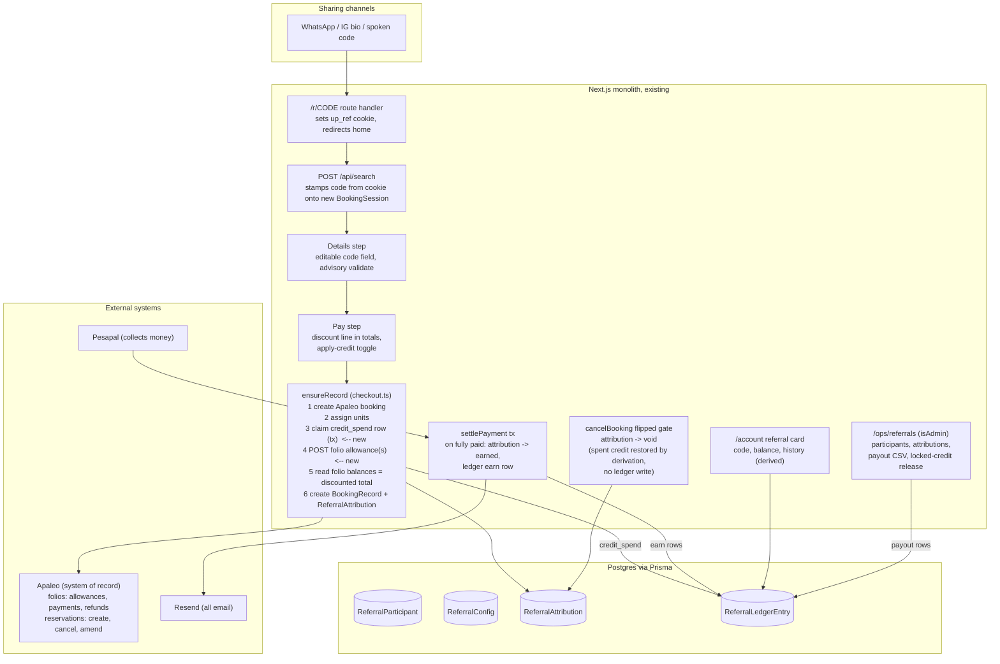
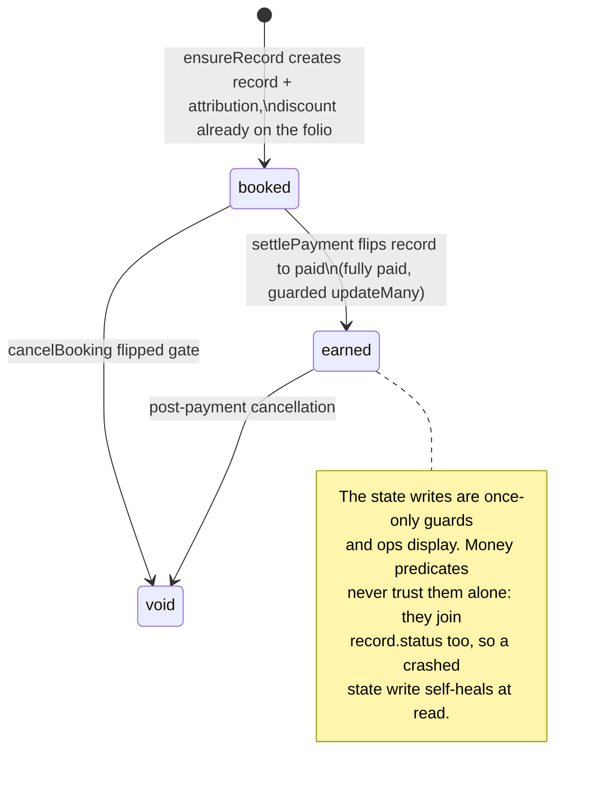

# Referral system: design and implementation plan

Status: BUILT, 5 Aug 2026, on branch referral-system. All phases 0-6 are
implemented, the Phase 0 spike passed all six items against UPNV (endpoint
is POST /finance/v1/folio-actions/{folioId}/allowances, vatType "Without",
scope folios.manage), and a live end-to-end referred booking verified the
discount, deposit, attribution, earn and void against the real sandbox.
Two rounds of post-build adversarial review (four lenses plus refutation
agents each) found two blocking defects apiece; the second round's were
regressions in the first round's fixes, both in the credit-claim
lifecycle. All fixes are in code, verified by live sandbox bookings for
the discount path AND the credit path, and the design refinements are
folded into sections 6.3 and 11 below, marked "(review)". This document
remains the architecture reference.
Scope: the original two groups from the Referral Growth System report v2.0
(Drive): the influencer track (cash commission) and the client track
(guest-to-guest credit). The Unity Family and group-organizer tracks are
deferred; the schema deliberately leaves room for them.

This document is written to be critiqued. Every claim about existing code
carries a file reference, every design decision states the alternative it
beat and why, and section 11 lists the places most worth poking at. A
first draft was adversarially reviewed against the codebase; the review
found three genuine design flaws (all in the credit-redemption lifecycle)
and the fixes are folded in below, marked where they changed the shape.

---

## 1. What we are building

Two referral tracks on one engine:

- **Influencer track.** A vetted creator gets a permanent vanity code
  (AMINA). Bookings made with it give the guest an instant fixed discount,
  and after the stay completes the influencer earns a percentage commission
  on the lodging value, paid out monthly as real money (manual M-Pesa or
  bank transfer at launch, CSV-driven).
- **Client track.** Any guest with an account gets a permanent code. Same
  instant discount for the referred guest; the referrer earns a fixed
  resort credit that becomes spendable after the referred stay completes,
  redeemable against their own next booking. Credit only, never cash.

Engine principles inherited from the report, kept intact:

- A code identifies a person and nothing else. Amounts live in dated config
  rows; the config in force when the booking is created picks the numbers.
  Codes never change.
- The code is captured at our checkout. Apaleo has no concept of referrals.
- Money in is instant (discount visible before payment), money out vests
  post-stay.
- Append-only ledger. No stored balance column anywhere; a balance is
  always a sum over a participant's rows.
- One code per booking, frozen at booking creation, no stacking.

What we are **not** building now: webhooks, schedulers, WhatsApp, payout
automation, tiers, a review-queue UI, cross-vertical namespace activation.
Section 10 shows where each one bolts on later.

---

## 2. The mental model in one paragraph

The referral engine is a passenger on the existing booking machine, not a
second machine. It stamps a code onto the `BookingSession`, posts one
discount onto the Apaleo folio at the only moment the money math allows it
(inside `ensureRecord`, before the folio balances are read and frozen), and
records an attribution row in the same breath as the `BookingRecord`. From
then on it writes nothing except at the two moments the booking machine
already treats as sacred: the guarded status flip to `paid` (earn the
reward) and the guarded flip to `cancelled` (void it). Everything else,
vesting, expiry, balances, payout dues, even the restoration of spent
credit when a booking cancels, is derived at read time from the ledger
plus the booking's own state. That is the house pattern: the deposit plan
explicitly ruled out "any scheduler or jobs table" and declared "Overdue
is display-only, derived at read time"
(`docs/deposit-and-cancellation-plan.md:86-88`).

### House patterns this document leans on

Five repo idioms carry the concurrency story below. In one line each:

- **Guarded updateMany**: an `updateMany` whose `where` includes the state
  being left, so under any race exactly one caller sees `count === 1` and
  knows it won the transition (`server/booking/checkout.ts:1106`,
  `server/booking/cancellation.ts:217`).
- **Flipped gate**: the block in `cancelBooking` entered only when its
  guarded updateMany returned count 1; the cancellation email already
  lives there (`server/booking/cancellation.ts:221`).
- **Claim-release stamp**: a nullable DateTime claimed atomically
  (updateMany where the column is null) before sending an email, released
  only on send failure, so an email can never send twice
  (`server/email/bookingConfirmation.ts:41`).
- **P2002 adopt-the-winner**: two racing checkout tabs; the loser's create
  hits the unique constraint and adopts the winner's record instead of
  erroring (`server/booking/checkout.ts:698-710`).
- **Session row as the only attribution source**: checkout retries can
  arrive logged out and cookieless, so anything checkout needs must live
  on the `BookingSession` row, never in a cookie
  (`server/booking/checkout.ts:680`).

---

## 3. Architecture



The attribution lifecycle, deliberately smaller than the report's five
states because REFUSED is a synchronous rejection (nothing stored) and
the report's REWARD_ISSUED/SETTLED live in the ledger, not on the
attribution:



---

## 4. Data model

Four new Prisma models. Conventions follow the existing schema: money is
Float whole KES (same demo caveat as `BookingRecord.totalGrossAmount`,
`prisma/schema.prisma:218`), states are plain strings, emails are stored
lowercase via `normalizeEmail` (`server/auth/normalize.ts:8`). Schema
changes ship by `prisma db push`, local first, never `prisma migrate`
(this repo has no Prisma migrations directory; the root `migrations/` is
Payload's own system and unrelated). `BookingRecord`, `BookingSession`,
and `User` gain the matching back-relation fields, omitted here for
brevity.

```prisma
// A person who can refer: an influencer we onboarded or a client who
// claimed their code. The code is permanent and identifies the person,
// nothing else; amounts live in ReferralConfig.
model ReferralParticipant {
  id        String    @id @default(cuid())
  createdAt DateTime  @default(now())
  kind      String    // "influencer" | "client" (room for "family", "organizer" later)
  name      String
  email     String?   // lowercase; self-use checks compare against this
  phone     String?
  code      String    @unique // 5-7 chars, alphabet without 0/O/1/I; vanity for influencers
  commissionRate Float? // influencers: null means the config default in force at booking
  userId    String?   @unique
  user      User?     @relation(fields: [userId], references: [id]) // client participants
  revokedAt DateTime? // revoked codes refuse at validation; rows are never deleted

  attributions ReferralAttribution[]
  ledger       ReferralLedgerEntry[]
}

// Dated program parameters. Append-only: to change an amount, insert a new
// row with a later effectiveFrom. "In force" always means the latest row
// whose effectiveFrom is on or before the UTC date ensureRecord runs,
// never the stay dates. Amounts are frozen into the attribution, so
// config changes never rewrite history.
model ReferralConfig {
  id             String   @id @default(cuid())
  createdAt      DateTime @default(now())
  effectiveFrom  String   // ISO date
  guestDiscount  Float    // whole KES off the referred booking
  clientCredit   Float    // whole KES credit for a client referrer
  defaultCommissionRate Float // used when an influencer's own rate is null
  creditExpiryDays      Int  // client credit only; commissions never expire
}

// One referred booking. Created in the same nested create as BookingRecord,
// so it exists exactly when the record exists. All amounts frozen here;
// discountAmount is what was actually posted to the folios, which the cap
// rule (6.3) can make smaller than the configured figure.
model ReferralAttribution {
  id            String   @id @default(cuid())
  createdAt     DateTime @default(now())
  recordId      String   @unique
  record        BookingRecord       @relation(fields: [recordId], references: [id])
  participantId String
  participant   ReferralParticipant @relation(fields: [participantId], references: [id])
  configId      String
  discountAmount  Float   // posted to the folio(s), not the configured number
  rewardAmount    Float   // frozen: clientCredit, or rate * commissionBase
  commissionBase  Float?  // influencer only: lodging gross minus discount, frozen
  gift          Boolean  @default(false) // owner booked for someone else: discount yes, reward no
  state         String   @default("booked") // booked | earned | void
  earnedAt      DateTime?
  voidedAt      DateTime?
  allowanceRefs String   @default("[]") // JSON: per-folio Apaleo allowance ids
  rewardEmailAt DateTime? // claim-release stamp, confirmationEmailAt discipline
}

// Append-only value ledger. Every amount is SIGNED whole KES: earns are
// positive, spends and payouts negative. Every derived figure in this
// document is a plain SUM(amount) over a filtered set of rows; no formula
// ever subtracts a sum, so signs are stated once, here. No row is ever
// updated or deleted.
model ReferralLedgerEntry {
  id            String   @id @default(cuid())
  createdAt     DateTime @default(now())
  participantId String
  participant   ReferralParticipant  @relation(fields: [participantId], references: [id])
  attributionId String?  // earns point at their attribution; null on spends/payouts/releases
  attribution   ReferralAttribution? @relation(fields: [attributionId], references: [id])
  kind          String   // credit_earn | credit_spend | commission_earn | payout | credit_release
  amount        Float    // signed: earns and releases positive, spends and payouts negative
  spentOnSessionId  String? @unique // credit_spend: the BookingSession it rode (one spend per session)
  spentOnSession    BookingSession? @relation(fields: [spentOnSessionId], references: [id])
  releaseOfEntryId  String? @unique // credit_release: the spend it unlocks (ops action, one per spend)
  payoutBatchId String?  // payout rows: deterministic batch id, e.g. "2026-09-influencers"

  // One earn of each kind per attribution, ever. Spend/payout/release rows
  // keep attributionId null; Postgres unique indexes treat nulls as
  // distinct, so they never collide here, and they must stay null.
  @@unique([attributionId, kind])
}
```

Notes a reviewer will want:

- The relations exist because every flow depends on them: the attribution
  rides `BookingRecord`'s nested create through a relation field (the
  `reservations:` create at `checkout.ts:684-693` is the precedent), and
  every derived predicate below traverses
  ledger -> attribution -> record -> session.
- A spend is keyed to the **session**, not the record, because it is
  written moments before the record exists (section 6.3 explains the
  ordering). `BookingRecord.sessionId` is unique, so the session
  identifies the eventual record.
- Two invariants, enforced ruthlessly, both straight from the report:
  amounts are computed once from the config in force and frozen (config
  and participant-rate edits never change history), and no balance is
  ever stored, only summed.
- Why no separate `codes` table: the report has one to support revocation
  with reissue. Our rule is one permanent code per person, and revocation
  means revoking the person (`revokedAt`). A join table with one row per
  person forever is structure without information.

---

## 5. The money path, in detail

This is the load-bearing section. The existing payment engine has a strict
internal consistency contract, and the recon of `server/booking/checkout.ts`
shows there is exactly one safe way to introduce a discount.

First, the Apaleo vocabulary the section depends on. Every lodge in a
booking gets its own **folio**, the guest's bill: charges on one side,
payments on the other, and a running **balance** that is negative while
money is owed and zero when settled (`server/apaleo/bookings.ts:97`); the
engine always reads the absolute value. An **allowance** is Apaleo's
discount line on a folio: our working hypothesis is that posting one
reduces what the folio demands, so the balance shrinks by the allowance
amount while the original charges stay visible, which is what finance
wants and what makes program cost a query. That hypothesis is exactly
what Phase 0 tests (5.3); nothing in this repo has ever called the
allowances endpoint.

### 5.1 How the current engine freezes money

`ensureRecord` (`server/booking/checkout.ts:578`) creates the Apaleo
booking, assigns units, then reads one folio per lodge and computes
`total = sum of |folio.balance|` (`checkout.ts:661`). That number becomes
`BookingRecord.totalGrossAmount`, each lodge's `grossAmount`, and the 30%
`depositAmount`, written once in a single nested create
(`checkout.ts:665-697`) and never updated again. Every later actor
validates against it:

- Pesapal collection amounts must match within 0.01
  (`server/pesapal/status.ts:33`).
- `settlePayment` accepts exactly two live folio balances per lodge:
  untouched, or already-posted-by-a-crashed-replay (`checkout.ts:1009-1038`).
  Anything else wedges the booking with "Folio drifted from local
  bookkeeping".
- `paidAmount` is derived as `grossAmount - |folio.balance|`
  (`checkout.ts:1086`), so any post-hoc folio change silently corrupts
  paid math even where the wedge does not fire.

Consequence: **the discount must exist on the folio before the balance
reads at `checkout.ts:657-660`, and can never be posted later.** On a
`created` or `deposit_paid` booking, a late allowance wedges the next
settle. On a fully `paid` booking nothing wedges (no settle ever runs
again), but the failure is quieter and still forbidden: the folio strands
a credit nobody refunds, and a later amendment would silently absorb it
(`app/api/booking/[bookingId]/amend/route.ts:200` settles only negative
balances). Broken differently in every state, so: never, including an
admin "fixing" a missed code after the fact.

### 5.2 Where the discount is born

Inside `ensureRecord`, strictly after `assignUnits` (`checkout.ts:653`,
because its 422 fallback can remove the location fee service from a folio,
`checkout.ts:797-799`) and strictly before the folio reads. New step:

1. Re-validate the code from the session row (exists, not revoked, not
   self-use). The session snapshot is display-only; this check is the
   authoritative one. **If it refuses** (code revoked mid-funnel, or
   self-use only now detectable from final guest details), the checkout
   fails with a friendly "that code is no longer valid" and, in the same
   breath, the code and discount snapshot are cleared off the session so
   every totals surface re-renders honestly. That mirrors the
   `locationFeeDropped` cleanup discipline (`checkout.ts:717-727`).
   Silently proceeding undiscounted is not an option: the guest would be
   charged more than every screen showed them.
2. Compute `discountAmount` from the config in force. Whole KES,
   `Math.round`, matching house arithmetic.
3. Split it across the N folios pro-rata, **basis: the session's
   per-lodge snapshots** (stayGrossAmount + extras + location fee), last
   folio takes the exact remainder, shares clamped. The snapshots exist
   before the record does and are identical on every retry, which makes
   the split deterministic under crash-replay. (First draft said pro-rata
   by live folio balance; the adversarial review pointed out that settle's
   own doc comment forbids exactly that, `checkout.ts:849-853`: a crash
   between two posts changes a live-balance basis on replay, inflating
   the recomputed shares and mutating the idempotency key's body.)
4. POST each share as a Finance API allowance, idempotency key
   `up-allow-<sessionId>-<slot>`, reason `UP-REFERRAL-<code>`, following
   the payFolio conventions (`server/apaleo/payments.ts:12`). New helper
   `postAllowance` beside it; `server/apaleo/client.ts` stays the only
   file speaking HTTP to Apaleo.

Then the existing folio reads run unchanged and **absorb the discount into
everything automatically**: `totalGrossAmount`, per-lodge `grossAmount`,
`depositAmount` (so the 30% deposit is 30% of the discounted total),
the Pesapal order, the settle split basis, balance-payment outstanding
(`app/api/booking/[bookingId]/pay/route.ts:48`), and cancellation refunds
(`computeRefund` works from `paidAmount`/`depositAmount`,
`lib/paymentPlan.ts:81`). No downstream code learns the discount exists.
This is the single biggest simplification in the design and the reason
the allowance approach was chosen.

One freeze rule completes the picture: **once a `BookingRecord` exists,
the session's referral fields are read-only.** The details route ignores
code changes on such sessions and the UI renders the code fixed. Without
this, a guest returning to the details step after a failed payment could
stamp a new code the frozen record will never honour, and the pay page
would display a discount Pesapal will not collect
(`setGuestDetails` updates unconditionally today,
`server/booking/session.ts:188`).

Crash windows: `ensureRecord` is a sequence of network calls with no
umbrella transaction; recovery is by idempotency keys plus the P2002
adopt-the-winner path. The allowance posts get the same protection as the
booking create itself (`up-book-<sessionId>`, 24h Apaleo dedup window).
A checkout stuck for more than 24h mid-sequence is already a manual case
today; the allowance inherits that boundary rather than inventing a
stronger one.

### 5.3 What Phase 0 must prove in the sandbox

Nothing in the repo has ever called the allowances endpoint; its request
shape and required OAuth scopes are unverified. The spike proves, against
UPNV:

1. POST allowance on a fresh folio succeeds with our client credentials.
2. The folio balance afterward equals gross minus allowance (what
   `ensureRecord` will read).
3. A later `payFolio` of exactly that balance settles the folio to zero.
4. `refundFolio` still behaves on a folio carrying an allowance.
5. VAT treatment of the allowance is coherent in the folio breakdown (we
   only ever read gross, but the folio must not end up malformed).
6. Amending a reservation whose folio carries an allowance, to costlier
   and to cheaper dates, leaves the balance reading as new gross minus
   allowance minus payments. The amend route re-reads balances and posts
   phantom settling payments (`amend/route.ts:197-213`); if Apaleo voids
   or reattaches allowances on amendment, that surfaces as silent over or
   under payment a year later, so it gets proven now.

Fallback if allowances are unusable: post the discount as a method
"Other" *payment* at the same point in `ensureRecord`. Mechanically
identical (balance shrinks before the reads), precedent exists (the amend
route already absorbs reprice debits with phantom "Other" payments), but
it records money-received that never existed, so program cost reporting
and folio honesty degrade. Acceptable fallback, not the recommendation.
(Rejected outright: adjusting the charged amount locally. The engine's
invariant is that no price is ever computed locally,
`server/apaleo/bookings.ts:74-78`, and the settle validations would fight
a local discount at every step.)

### 5.4 Display totals

Four surfaces show money and all four must agree with the folio truth:

1. The session GET (`app/api/session/[id]/route.ts:35-43`), which feeds
   every funnel page. It returns the code and validated `discountAmount`
   snapshot stamped at the details step.
2. The right-rail `BookingSummary` (`components/BookingSummary.tsx:53-56`):
   gains a discount row feeding its total bar.
3. `PayClient`'s advisory sum
   (`app/(site)/checkout/pay/PayClient.tsx:104-111`): subtracts the
   discount (and any applied credit) before rendering the buy button and
   deposit split.
4. The confirmation page, which the first draft forgot: it itemizes
   per-lodge `stayGrossAmount` snapshots
   (`ConfirmationClient.tsx:174`) next to the folio-derived record total,
   and on a referred booking those lines would visibly sum to more than
   the total. It gains a "Referral discount" line rendered from the
   attribution, which exists whenever the record exists, and doubles as
   the guest-facing proof their discount applied.

Server-side money never trusts any of these numbers; they are advisory,
like everything else in the funnel.

---

## 6. Lifecycle walkthroughs

### 6.1 A referred booking, end to end

1. Brian taps `unityparks.com/r/AMINA` in WhatsApp. `/r/[code]` is a route
   handler (the only place cookie writes are allowed,
   `server/auth/session.ts:19-20`) that sets an `up_ref` cookie (httpOnly,
   sameSite lax, 30 days) and redirects to the homepage. The funnel itself
   is cookieless by design; the referral cookie only bridges the gap until
   a `BookingSession` exists.
2. Brian searches. `POST /api/search` reads the cookie (it already reads
   the auth cookie there, `app/api/search/route.ts:68`) and stamps the code
   onto the new session row, same pattern as `userId`. From here the
   cookie is irrelevant: the session row is the attribution source.
3. At the details step Brian sees "Referral code: AMINA" prefilled and
   editable. An advisory `POST /api/referral/validate` call (same
   degrade-to-unknown shape as the email-status check,
   `DetailsClient.tsx:233-254`) shows "KSh 5,000 off applied" or a
   friendly refusal. Last code standing at details submit wins; it
   persists via `setGuestDetails`. (Route naming caveat: explicit
   `app/api` routes beat Payload's catch-all, but a future Payload
   collection slugged `referral` would collide; acceptable, noted.)
4. Buy now. `ensureRecord` runs section 5.2: allowances posted, folio
   reads absorb them, `BookingRecord` and `ReferralAttribution` created in
   one nested create (atomic; the P2002 loser adopts the winner's record
   and creates nothing).
5. Brian pays (deposit or full) through the untouched Pesapal machinery.
6. When the record flips to `paid` (fully paid) inside settle's guarded
   transaction (`checkout.ts:1101-1153`), two DB-only writes join it. The
   attribution's own guarded updateMany flips `booked -> earned`, and
   **only when that returns count 1** does the earn row insert:
   `commission_earn` or `credit_earn`, amount always the attribution's
   frozen `rewardAmount`, never recomputed from live rates or configs.
   The `@@unique([attributionId, kind])` constraint stays as a backstop
   with P2002 swallowed, not propagated. This ordering matters: settle
   twins (callback vs IPN) both legitimately reach this code with the
   record already paid (`checkout.ts:1106` guards only against
   `cancelled`), so gating the insert on the record flip, or letting the
   constraint throw inside the transaction, would abort the losing twin's
   otherwise-idempotent settle. Skipped entirely when `gift`.
7. Amina's "reward on the way" email sends from the settle tail alongside
   the existing confirmation email (`checkout.ts:1167-1177`), stamped
   once-only on `rewardEmailAt` with the claim-release discipline. It
   says the reward is **expected from** the stay's departure date, worded
   as an expectation because an amendment can move the date and a
   cancellation can void the reward after the email is sent (the same
   mid-settle race window the confirmation email already accepts,
   `cancellation.ts:222-249`).

Referred bookings that never pay: a record can sit at `created` forever
(abandoned Buy now) or go `failed`; nothing in the engine terminates
those states. The attribution stays `booked` and earns nothing by
construction, and every participant-facing and ops surface excludes it
from pending counts once its record is neither paid-track nor fresh:
displayed as lapsed, filtered by the same read-time joins as everything
else. No new state, no cleanup job.

### 6.2 Cancellation

`cancelBooking`'s flipped gate (`server/booking/cancellation.ts:217-221`)
gains exactly one write: flip the attribution to `void`. Nothing else is
needed, and the first draft's second write here (a compensating
`credit_reversal` row restoring spent credit) was deleted after review
for being unsafe: the gate body is not atomic with the status flip, and
a crash between them never re-enters the gate (retries take the
already-cancelled early return, `cancellation.ts:159-163`), which would
have lost the guest's credit permanently. Instead, spent credit restores
itself **by derivation**: the spendable sum simply stops counting a
`credit_spend` whose booking is `cancelled` (section 6.3). A lost `void`
write is equally harmless, because every money predicate joins
`record.status` and treats a cancelled record as void regardless; the
attribution state is a once-only guard and an ops label, not the truth.

Pre-stay there is never vested outbound value to claw back, which is the
entire point of post-stay vesting. The folio allowance needs no unwinding
either; the reservation is cancelled and refunds already compute from the
discounted `paidAmount`. The guest's code remains usable on a future
stay. (The velocity view covers the book-cancel-rebook farming loop;
section 9.)

### 6.3 Credit: vesting, redemption, restoration

All credit arithmetic is one signed sum. A participant's **vested
balance** is `SUM(amount)` over their rows where:

- `credit_earn`: attribution not void, its record still `paid`, the
  stay's departure (read live from the record's session, so amendments
  move it) is in the past, and departure plus `creditExpiryDays` is not.
- `credit_spend`: the spend is *active*, meaning its session has a record
  in `deposit_paid` or `paid`, **or** its record is `created`/absent with
  the session still fresh (a checkout plausibly in flight). A spend whose
  record is `cancelled`, or whose session expired without ever producing
  a record, simply stops counting: cancellation and abandonment restore
  credit with zero compensating writes.
- `credit_release`: an ops-only positive row (below).

Deriving departure from the live session row means an amended break
automatically moves vesting and expiry with the stay, with no stored
maturity to go stale. Honesty note: session dates can lag Apaleo after a
crashed or part-failed amend (the amend route updates the session last
and outside any transaction, `amend/route.ts:215-218`), and this design
makes them money-load-bearing for the first time. Those crash paths are
already loud manual cases; the eventual reservation-status check at vest
time (section 7) would read real dates from Apaleo at the same moment.

**Redemption.** Amina signs in and books her own break. The pay step
shows "Apply KSh N referral credit" (N = her vested balance, capped so at
least KSh 500 of the booking remains collectable, matching the
whole-KES minimum the part-payment rules already enforce,
`lib/paymentPlan.ts:104-109`). Accepting POSTs a small
`/api/session/[id]/credit` route that stamps `applyCredit` and an
advisory amount onto the session row, because the pay page's own state
does not survive the Pesapal bounce and checkout retries read only the
session. Then, inside `ensureRecord`, before any allowance posts:

1. A short interactive transaction (Serializable) re-derives her vested
   balance authoritatively, clamps it against the cap, and inserts the
   `credit_spend` row keyed by `spentOnSessionId`. The unique key makes a
   crash-replay find its own row and reuse its amount; the isolation
   level makes two concurrent redemptions of the same pool a refused
   conflict instead of a silent double-spend. (First draft had no
   serialization at all: two tabs could spend the same credit on two
   bookings, and the per-booking unique constraints never notice.
   The house serializer, `liveForRecordId`, is per-record; this is the
   per-participant equivalent, done as derive-then-insert in one
   transaction because the DB write must precede the folio side effect.)
2. The credit posts as its own allowance family,
   `up-credit-<sessionId>-<slot>`, reason `UP-CREDIT-<code>`, same
   deterministic snapshot split as the discount. Its own key family
   because a booking can carry both a referral discount and a credit
   redemption, and "identical mechanics" on the same key would have one
   allowance silently swallowed by Apaleo's dedup.
3. `credit_spend.amount` is the amount actually posted, which the cap can
   make smaller than the vested balance offered on screen.

If the authoritative re-derivation comes up short (balance changed since
the pay page rendered), the checkout refuses with a friendly message and
clears `applyCredit`, same discipline as a refused code.

**The claim is authoritative, the flag is display (review).** The first
adversarial review found the original design's blocking flaw: a claim
committed by a failed attempt while the guest could still untick the
credit box would post no allowance yet count against the pool forever.
Checkout therefore adopts an unreleased claim for its session even when
`applyCredit` is false (the claim, never the flag, is the money truth),
and unticking before a record exists gives the claim back to the pool.

**The claim row owns its own state (second review).** The first fix left
the release recorded as a *separate* ledger row, which let two actors
decide a claim's fate independently: a guest unticking while a checkout
was mid-flight could restore the pool while the allowance still landed on
the bill, and a re-claim colliding with a released slot adopted it
blindly. Both handed out the same credit twice. So the spend row now
carries `releasedAt` and `postingStartedAt`, and every actor takes a
**guarded write on that one row**: checkout marks it committed
immediately before posting its allowance, and a release marks it
released, refusing once posting has begun. The database serializes them,
the loser's guard returns count 0, and it backs off with an honest
message. The paired `credit_release` row remains as the ledger's value
entry, but no code decides anything by reading it. A released slot can
never be re-claimed (one spend per session, ever), so re-applying credit
to that same booking is refused with the credit staying good for the
next one. A claim is also honoured only for the account that made it: on
a shared machine, an identity change gives it back to its owner rather
than spending it on a stranger's booking.

**The locked-credit edge, stated honestly.** A spend rides a record that
reaches `created` and then is abandoned forever: the money path can
neither pay nor cancel it (`cancelBooking` refuses non-paid records,
`cancellation.ts:91-101`), so the spend stays active and the credit stays
locked. This is rare (a Buy now that created the record and then never
paid, past the session's freshness window) and deliberately manual, in
the house log-and-reconcile style: the `/ops/referrals` page lists spends
on stale `created` records, and an admin action appends the
`credit_release` row (unique `releaseOfEntryId`, one release per spend,
ever). An automatic time-based release was considered and rejected: a
`created` record is resumable indefinitely by design, and auto-released
credit re-spent elsewhere would double-redeem if the original checkout
then resumed.

Accepted simplification: expiry is computed per-earn but spends are not
FIFO-matched to specific earns. With fixed-size earns, 12-month expiry,
and our volumes, a spend simply reduces the pool; the theoretical
inaccuracy is pennies of generosity in the guest's favour. Revisit only
if volumes make it matter.

### 6.4 Influencer payout

Owed per influencer is the same signed sum: matured `commission_earn`
rows (vesting predicate **without the expiry clause**, commissions are
contracted cash and never expire) plus prior negative `payout` rows.
The `/ops/referrals/payouts` page lists it, exports a CSV (name, phone,
KRA PIN placeholder, gross, note for the accountant's WHT), and on "mark
batch paid" appends one `payout` row per influencer with a deterministic
`payoutBatchId` like `2026-09-influencers`, so a double-click or re-run
cannot double-pay. Allan moves the actual money by hand. M-Pesa B2C
automation later replaces the hand-move, nothing upstream changes.

Commission base: lodging only, per the report, frozen at attribution time
as the sum of the session's `SessionLodge.stayGrossAmount` snapshots
**minus the referral discount**. The snapshots are pre-discount offer
prices, and paying commission on revenue the program itself gave away
(the review sized it at KSh 200-250 per booking at a 4-5% rate) would be
a structural leak, so the base is net of the discount, floored at zero.
It is a **gross** (VAT-inclusive) figure: nothing in this codebase ever
sees an ex-VAT amount (verified across every Apaleo read), and deriving
one locally (gross / 1.16) would be the first locally computed price in
the engine. Instead the commission *rate* is set with VAT in mind: 4% of
gross is about 4.6% of ex-VAT value. The report's ex-VAT framing is a
statement about fair economics, and a rate chosen against gross achieves
the same economics without new machinery. Flagged as an open decision.

Frozen-base honesty: an amendment can reprice a stay with almost no trace
on the record (the amend route settles folio deltas with phantom payments
and rewrites only the session dates plus cleared unit assignments; no
amount field anywhere is touched). The commission base is frozen at
attribution and will not track that. This matches how cancellation
refunds already behave (they too compute from frozen amounts), and at a
4-5% rate the drift is small. Documented, not fought.

Influencer visibility, stated because a developer will ask: **there is no
influencer dashboard at launch.** An influencer's window is the
per-attribution "reward on the way" email and the monthly payout note
Allan sends with the transfer. A self-serve earnings view is a listed
add-on; the `userId` column on the participant is the seam (link an
influencer to an account later, and the account referral card learns to
render commission rows).

---

## 7. Why derive-at-read instead of a vesting cron

My first draft had a daily sweep flipping ledger rows to "matured". The
recon killed it, for three reasons worth internalizing because they
generalize:

1. **The codebase has no scheduler on purpose.** No cron route, no jobs
   table, no queue, nothing (grep-verified). The deposit plan explicitly
   ruled one out and derives "overdue" at read; the memories counter
   derives at read (`server/memories.ts:28`). Vesting is the same shape:
   a predicate over data we already hold (departure date, paid status),
   not an event we must be told about.
2. **A sweep adds a failure mode without adding truth.** Whether a stay
   completed is decided by the departure date and the booking not being
   cancelled. A cron that stamps "matured" can only agree with that
   predicate or be a bug.
3. **Apaleo webhooks buy latency we do not need.** Rewards are post-stay
   by design; nobody is waiting on a minute-level vest. When webhooks
   arrive later (section 10) they make notification timing nicer and
   nothing else.

The adversarial review then pushed the same principle further than the
draft had: the credit-restoration write in the cancel path and the
compensating-reversal bookkeeping are gone entirely, replaced by
predicates (6.2, 6.3). The pattern held every time a compensating write
looked necessary, and each removal deleted a crash window.

Deliberately accepted consequence: we vest on "departure passed + fully
paid + not cancelled" rather than confirming an Apaleo `CheckedOut`
status. In the sandbox nobody performs check-outs, and in production a
paid, uncancelled, departed booking that was a no-show is a policy
question (Center Parcs keeps the money; the referrer arguably still
earned). Reading reservation status at vest time is a two-line upgrade
inside the existing `getReservation` helper if that policy hardens, and
would read true stay dates past the amend-crash staleness window (6.3)
at the same time.

The one thing that genuinely wants a clock is a "your credit is now
spendable" email on vesting day. Core sidesteps it: the earn email at
payment time states the expected vesting date. A vested-day email is an
add-on riding the future cron, and no correctness depends on it.

---

## 8. Participants, capture, and surfaces

**Influencer onboarding** is an `/ops/referrals` form (name, phone, email,
vanity code, rate; leave the rate blank to ride the config default in
force at each booking). Vetting, contracts, and content standards stay
human processes per the report; the system stores the outcome.

**Client codes** are claimed, not pushed: a "Get your referral code"
button on the account page (and a nudge band on the confirmation page,
riding the existing `accountStatus` nudge stack,
`ConfirmationClient.tsx:251-277`) does a POST that creates the
participant with a generated code. Explicit claim keeps reads write-free
(house rule: reads never write, the `AuthSession` comment) and means
every participant consented to the program. Any signed-in user may claim;
gating on "has a paid stay" adds a check for no real fraud benefit, since
rewards only exist when a *referred* booking pays.

**Self-use and gifts**, honestly sized for what we can detect:

- Lead-guest email or phone matches the participant (via `normalizeEmail`):
  refused at validation with a friendly message. Re-checked
  authoritatively in `ensureRecord`.
- Signed-in booker IS the participant but the lead guest is someone else:
  allowed, `gift = true`. Discount applies, no reward accrues (nobody
  earns on their own payment).
- Undetectable: the participant books logged-out for a relative using
  their own code with the relative's details. Accepted; the "reward"
  is resort credit issued only after a genuinely paid stay, which is an
  over-generous loyalty scheme, not fraud economics (report A.6).

**Account surface**: a referral card on `app/(site)/account/page.tsx`
(code, share link, vested balance, pending and past rewards, all derived
sums), rendered entirely from the local DB like the rest of the page.
Lapsed attributions (6.1) are excluded from pending. The confirmation
page gains the discount line (5.4) and a "know someone who'd love this?"
band for signed-in owners.

**Admin surface**: `/admin` is owned by Payload's catch-all
(`app/(payload)/admin/[[...segments]]`), and Payload's admins collection
is deliberately walled off from the Prisma `User` table. So ops pages
live at `/ops/referrals` in their own route group, gated by a new
`isAdmin Boolean @default(false)` on `User` plus a `requireAdmin` helper
beside the currently-unused `requireUser` (`server/auth/session.ts:48`):
redirect for pages, `PublicError(403)` for routes. First admin is flagged
by a one-off script. This keeps one identity system per world: Payload
admins run content, the Prisma admin runs money.

---

## 9. Fraud posture

Buy incentive design, not identity verification (report A.6). At launch:

- Self-use refusal and the gift rule (section 8).
- One code per booking, frozen at record creation, immutable after.
- Post-stay vesting on everything outbound; cancellation voids by
  derivation.
- Per-participant redemption serialization (6.3), so credit cannot be
  double-spent even by a determined guest with two tabs.
- Velocity visibility: the `/ops/referrals` attribution list shows
  per-code counts over a rolling window; a threshold breach sends Allan
  an email. Every attribution counts, including abandoned ones, because
  a farmer generating unpaid bookings is exactly the pattern worth
  seeing (the list labels those rows lapsed). Ops sums are rendered
  unfloored, so a negative pool is visible, not hidden.
- Known inherited hole, documented: account claiming is email-match on
  unverified emails (`server/auth/claim.ts:11-15`, accepted for the
  demo). A client participant is only as authentic as their account
  email. Email verification is an account-system add-on, not a referral
  one.

Influencer commissions are the cash track and get the human controls:
manual payout runs (a person eyeballs the CSV), contractual clawback,
vetting before a code exists at all.

---

## 10. Build order and the add-on seams

Phases, each shippable and testable alone:

- **Phase 0, the spike.** Prove the allowance call in the UPNV sandbox
  (section 5.3, all six items). Half a day; decides allowance vs
  phantom-payment fallback. Everything after is insulated from the
  outcome.
- **Phase 1, schema and config.** Four models plus `User.isAdmin` and the
  back-relations, `prisma db push` locally, config seed script following
  `scripts/seed-cms.ts` conventions. Pure-logic vitest coverage for the
  split math, config selection, the signed-sum predicates, and the
  redemption cap, next to `lib/paymentPlan.test.ts`.
- **Phase 2, capture and validation.** `/r/[code]` route, cookie, search
  stamp, session fields, details-step card, `POST /api/referral/validate`,
  discount line on all four totals surfaces.
- **Phase 3, attribution and discount.** The `ensureRecord` changes,
  `postAllowance`, the refusal-cleanup and session-freeze rules. After
  this, referred bookings are discounted and recorded end to end.
- **Phase 4, earn and void.** Settle-transaction earn writes (gated on
  the attribution flip), cancel-gate void, the reward email.
- **Phase 5, redemption.** The credit stamp route, the Serializable
  spend claim, the credit allowance, restoration-by-derivation, account
  card.
- **Phase 6, ops.** `/ops/referrals` pages, influencer onboarding, payout
  CSV and mark-paid, velocity view, locked-credit release action.

Add-ons later, each with its seam already in place: payout automation
(replaces the hand-move behind `payoutBatchId`), WhatsApp notifications
(second implementation behind the email modules), Apaleo webhooks plus a
`pms_events` dedup table (faster notification timing; the read-time
predicates stay as truth), vested-day emails (first consumer of a real
cron route), an influencer earnings view (via the participant `userId`
seam), review-queue UI, Unity Family and organizer tracks (new `kind`
values and config fields on the same engine), cross-vertical namespace
(codes already carry no Parks prefix).

---

## 11. Where to poke holes (a critique map)

The decisions most worth attacking, with where their reasoning lives:

1. **Allowance at birth, never later** (5.1-5.2). The whole design leans
   on the folio-freeze analysis. If you can find a code path that reads
   folio balances before my insertion point, or a legitimate need to
   apply a code after checkout, the design has to answer it.
2. **Derive-at-read everywhere** (7, 6.2, 6.3). Counter-argument to try:
   is there any state change the system must *initiate* rather than
   answer at read time? (The review and I found exactly one, the
   vested-day email, and argued it away.)
3. **The locked-credit manual release** (6.3). A spend on an abandoned
   `created` record locks credit until an ops action. The automatic
   alternative was rejected for a double-redeem edge; check that
   reasoning.
4. **Serializable transaction for the spend claim** (6.3). The only
   Serializable usage in the codebase would be this one. Is the
   complexity paid exactly once, in one place?
5. **Commission on gross lodging, net of discount, with a VAT-adjusted
   rate** (6.4). An accountant may insist on true ex-VAT bases and WHT
   columns from day one.
6. **The gift/self-use detection boundary** (8). Honest but leaky by
   design. Is the leak acceptable to you?
7. **No partial-spend FIFO expiry** (6.3). Deliberate sloppiness in the
   guest's favour.
8. **`/ops` instead of Payload for admin** (8). If you would rather run
   referral ops inside the Payload panel you already log into, that is a
   real alternative with real costs (crossing the Prisma/Payload wall).
9. **Frozen commission base vs amendment reprices** (6.4), and session
   dates as the vesting source despite amend-crash staleness (6.3).
10. **Anonymous claim hole** (9). Inherited from unverified emails.

Known mechanical edges, documented so they do not surprise a reviewer:
the 24h Apaleo idempotency window bounds crash recovery exactly as it
already does for booking creation; the P2002 adopt-the-winner path means
post-create code in `ensureRecord` can run in a tab that created nothing
(the attribution rides the nested create precisely for this); a
`deposit_paid` booking that never completes payment earns nothing, and a
`created`/`failed` one is displayed as lapsed; the existing email modules
consume their once-only stamp even when Resend is unconfigured (skip
counts as sent), and the referral email modules copy the pattern as-is
for consistency; money is Float whole KES with 0.01 epsilons, same demo
caveat as everything else.

Two further edges from the adversarial review, accepted rather than
engineered away (review):

- **Stranded allowance on a crashed first attempt.** Allowances post
  moments before the record create; a crash in that gap, followed by the
  guest clearing or changing the code before retrying, can birth a record
  whose folio carries an allowance with no matching attribution. The
  window is sub-second, requires a code edit inside it, and the folio's
  reason string (`UP-REFERRAL-<code>`) makes it auditable; the fix (a
  pre-side-effect session lock) was judged not worth its complexity at
  this scale.
- **The in-flight freeze window, narrowed.** The route-level freeze
  guards cannot see a checkout mid-flight inside `ensureRecord` (seconds
  of Apaleo calls before the record exists). Checkout now re-checks for a
  freshly committed record immediately before posting any allowance and
  adopts instead of posting, which shrinks the exposed window from the
  whole flight to milliseconds; the residual race is accepted and would
  surface loudly as a settle drift wedge, not silent money loss.
- **Display flags reconciled, not trusted.** A credit toggled on while a
  checkout was in flight leaves a flag the frozen total never absorbed.
  `ensureRecord`'s existing-record path re-derives those flags from the
  ledger before the pay page renders again, so the funnel converges on
  the truth instead of promising a discount nobody will collect. The
  money surfaces (confirmation, ops) read the ledger directly and never
  the flags.

---

## 12. Open decisions (need Allan, block nothing)

- Guest discount amount (report placeholder: KSh 5,000). Constraint made
  explicit by the cap rule: discount plus any applied credit must leave
  at least KSh 500 collectable, so amounts must sit comfortably below the
  cheapest bookable break.
- Client credit amount (report placeholder: KSh 5,000).
- Default commission rate, stated against gross, net of discount (6.4).
- Credit expiry (report suggests 12 months). Commissions never expire.
- DECIDED (Allan, 4 Aug 2026): cancellation restores spent credit, via
  the derivation, no extra code.
- Velocity threshold for the alert email (proposal: 10 attributions per
  code per 30 days).
- DECIDED (Allan, 4 Aug 2026): the discount applies once per booking,
  not per lodge.
- Vanity code approval rules for influencers (length, taste, collisions
  with future family/organizer codes).
